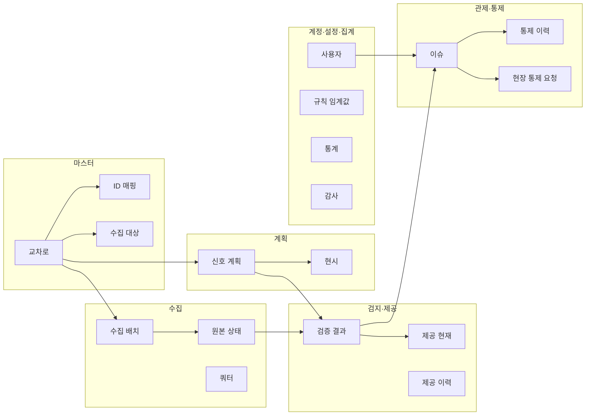
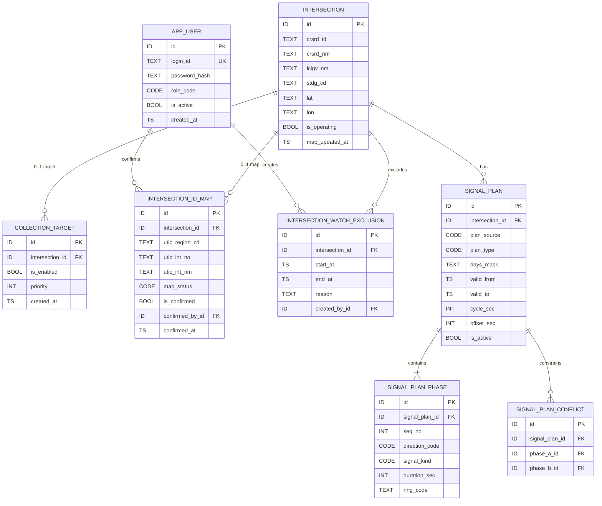
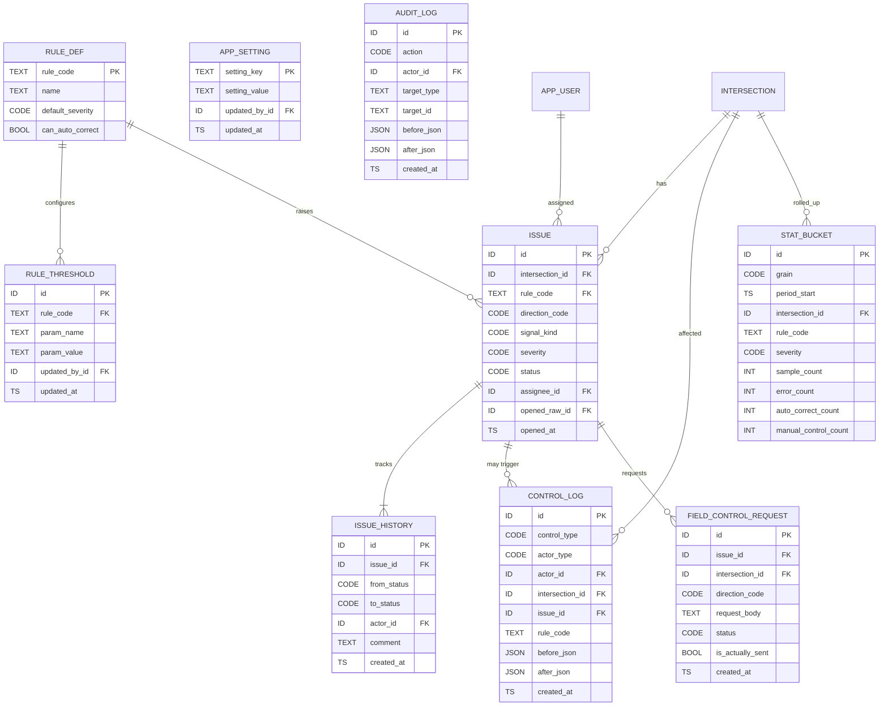

# Signal Guard 논리 ERD

| 항목 | 내용 |
|------|------|
| 문서명 | 실시간 교통신호 상태정보 오류검지 시스템 논리 데이터 모델 |
| 프로젝트 | Signal Guard |
| 버전 | 0.1 |
| 작성일 | 2026-09-19 |
| 작성 | 기경현 (백엔드·데이터), 조찬희 (기획·PM) |
| 단계 | 설계 1주차 (전체 4주, WBS-3.4) |
| 근거 | 요구사항정의서 9장, 시스템아키텍처 7장, SFR-003, DAR, FR-CTL-001 |

---

## 개정 이력

| 버전 | 일자 | 작성 | 변경 내용 |
|------|------|------|-----------|
| 0.1 | 2026-09-19 | 기경현, 조찬희 | 최초 작성. 개념 모델·논리 ERD·엔터티 사전·원본/제공 분리·명명 규칙을 확정. 물리 길이·파티션은 구현 EN-DB-01 |

---

## 1. 개요

### 1.1 목적

본 문서는 Signal Guard가 **무엇을 어떤 관계로 저장할지**를 고정한다. 마이그레이션(EN-DB-01)과 API 명세는 본 문서의 엔터티·컬럼 논리명을 출발점으로 한다.

핵심 불변식은 하나다.

**원본 수신(`signal_status_raw`)은 추가만 한다. 자동보정과 관리자 통제는 제공 계층만 바꾼다.**

### 1.2 문서 관계

```
요구사항정의서 9장 (반드시 남아야 하는 정보)
        │
        ▼
시스템아키텍처 7장 (저장 집합 S-RAW ~ S-STA)
        │
        ▼
본 문서 (개념·논리 ERD, 명명)     ← 데이터 구조 정본
        │
        ▼
EN-DB-01 마이그레이션 / API 명세 / 규칙 명세
```

| 구분 | 정본 |
|------|------|
| 무엇을 저장해야 하는가 | `분석/요구사항정의서.md` 9장 |
| 저장 집합·불변식 | `설계/시스템아키텍처.md` 7장 |
| 테이블·컬럼·관계 | **본 문서** |
| CREATE TABLE | 구현 주 EN-DB-01 |

### 1.3 범위

**포함 (논리 모델)**

- 주제영역(개념) ERD
- 논리 엔터티, 속성, 식별자, 카디널리티
- 코드 값, 무결성 규칙, 조회용 인덱스
- 원본/제공 분리와 쓰기 경로
- 저장 집합(S-*) ↔ 테이블 매핑

**포함하지 않음**

- `VARCHAR(n)` 확정, 파티션, 테이블스페이스 (구현)
- REST 경로 → `설계/API명세.md` (WBS-3.5, 0.1)
- R01~R12 임계 숫자 (WBS-3.6)
- 샘플 INSERT (시드 EN-SEED-01)

### 1.4 DBMS 가정

수업 MVP는 **PostgreSQL 1식**이다 (아키텍처 9장). 본 문서의 타입은 논리 타입이며, 구현 시 아래처럼 읽는다.

| 논리 타입 | PostgreSQL |
|-----------|------------|
| `ID` | `BIGINT GENERATED ALWAYS AS IDENTITY` |
| `TEXT` | `VARCHAR` 또는 `TEXT` |
| `INT` | `INTEGER` |
| `BOOL` | `BOOLEAN` |
| `TS` | `TIMESTAMPTZ` |
| `JSON` | `JSONB` |
| `CODE` | `VARCHAR` + `CHECK` 또는 소규모 코드 테이블 |
| `HASH` | `CHAR(64)` (SHA-256 hex) |

물리 서버를 나누지 않는다. 원본/제공은 **같은 DB의 다른 테이블**이다.

---

## 2. 설계 원칙

| ID | 원칙 | 적용 |
|----|------|------|
| DP-01 | 원본 불변 | `signal_status_raw`에 대한 UPDATE/DELETE를 앱 통제 경로에 두지 않는다. 가능하면 DB 롤에서 UPDATE/DELETE를 회수한다 | DAR-N-004, FR-STO-001 |
| DP-02 | 원본/제공 분리 | 대시보드 기본 값은 제공 테이블. 교차로 상세는 원본과 제공을 조인해서 병기한다 | FR-CTL-001 |
| DP-03 | 잔여시간 단위 | 원본은 센티초(`remaining_cs`). 제공·검증은 초(`remaining_sec`). 한 컬럼에서 혼용하지 않는다 | DAR-N-002 |
| DP-04 | 외부 ID ≠ PK | API `crsrdId`는 지자체 안에서만 유일할 수 있다. 내부 PK는 대리키 `id` | — |
| DP-05 | 계획 단일 스키마 | UTIC / 수동 / 추정 / 시드 모두 `signal_plan` | FR-PLN-001 |
| DP-06 | 이력은 append | 검증, 통제, 이슈 전이, 감사는 수정하지 않고 쌓는다 | FR-STO-002 |
| DP-07 | 현재 값은 별도 | 대시보드 3초를 위해 `signal_status_current`를 둔다. 이력은 `signal_status_provided` | NFR-PER-001 |
| DP-08 | 정규화는 중간값 | 센티초→초, 코드 매핑은 파이프라인에서 수행한다. 세 번째 “정규화 전용 영속 테이블”은 두지 않는다. 재검증은 원본을 다시 정규화한다 | 아키텍처 13장 |
| DP-09 | 명명 | 테이블·컬럼은 영어 snake_case. 논리명(한글)을 본 사전에 둔다 | DAR-N-001 |
| DP-10 | 신호기 테이블 없음 | 현장 등화기 명령 큐/전송 로그를 만들지 않는다. 현장 통제는 요청 기록만 | CON-003 |

---

## 3. 명명 규칙

| 대상 | 규칙 | 예 |
|------|------|-----|
| 테이블 | 단수형 snake_case | `intersection`, `issue` |
| 논리명 | 한글 | 교차로 마스터 |
| PK | 테이블마다 `id` | `issue.id` |
| FK | `{참조테이블}_id` | `issue.intersection_id` |
| 외부 업무키 | 원 시스템 약어 유지 | `crsrd_id`, `utic_int_no` |
| 시각 | `*_at` (`TIMESTAMPTZ`) | `received_at`, `created_at` |
| 일자 | `*_date` | `usage_date` |
| 플래그 | `is_*` | `is_blocked`, `is_confirmed` |
| 코드 | `*_code` | `direction_code`, `rule_code` |
| 상태 | `status` | 이슈·배치·요청 |
| JSON 확장 | `*_json` | `payload_json`, `detail_json` |
| 해시 | `*_hash` | `payload_hash` |

예약어·복수형 혼용(`users`, `user`)을 피하기 위해 계정 테이블은 `app_user`다.

코드 값은 본문 5장의 열거를 따른다. 1차에서는 별도 코드 마스터 테이블을 강제하지 않고 `CHECK`로 둔다. 값이 늘어나면 코드 테이블로 승격한다.

---

## 4. 개념 모델 (주제영역)

요구사항 9.1과 아키텍처 저장 집합을 여섯 덩어리로 본다.



| 주제영역 | 저장 집합 | 테이블 |
|----------|-----------|--------|
| 마스터 | S-MAP | `intersection`, `collection_target`, `intersection_id_map`, `intersection_watch_exclusion` |
| 계획 | S-PLN | `signal_plan`, `signal_plan_phase`, `signal_plan_conflict` |
| 수집 | S-RAW | `collection_batch`, `collection_failure`, `quota_daily`, `signal_status_raw` |
| 검지·제공 | S-PUB, S-VAL | `signal_status_provided`, `signal_status_current`, `validation_result` |
| 관제·통제 | S-ISS, S-CTL | `issue`, `issue_history`, `control_log`, `field_control_request` |
| 계정·설정·집계 | S-USR, S-AUD, S-STA | `app_user`, `rule_def`, `rule_threshold`, `app_setting`, `stat_bucket`, `audit_log` |

---

## 5. 코드 값

애플리케이션·CHECK 제약이 공유하는 값이다. 화면 한글 라벨은 코드 사전으로 매핑한다.

### 5.1 역할 · 출처 · 등급

| 코드 그룹 | 값 | 의미 |
|-----------|----|------|
| `role_code` | `OPERATOR` / `ADMIN` | 운영자 / 관리자 |
| `plan_source` | `UTIC` / `MANUAL` / `ESTIMATED` / `SEED` | 계획 출처 |
| `plan_type` | `OPERATING` / `WEEKDAY` / `HOLIDAY` / `RESERVATION` | TOD 종류 |
| `severity` | `INFO` / `WARN` / `ERROR` / `CRITICAL` | 오류 등급 |
| `map_status` | `UNMAPPED` / `CANDIDATE` / `CONFIRMED` | ID 매핑 상태 |

### 5.2 방향 · 현시 · 점등

실시간 API 접두·접미와 맞춘다. 계획 현시도 같은 코드를 쓴다.

| 코드 그룹 | 값 |
|-----------|-----|
| `direction_code` | `nt` `et` `st` `wt` `ne` `se` `sw` `nw` |
| `signal_kind` | `Stsg` 직진, `Ltsg` 좌회전, `Pdsg` 보행, `Utsg` 유턴, `Bssg` 버스, `Bcsg` 자전거 |
| `light_status` | `STOP_AND_REMAIN` (정지), `PROTECTED_MOVEMENT_ALLOWED` (통행 허용) |

원본 JSON의 `stop-And-Remain` 등은 정규화 파이프라인이 위 표준 코드로 바꾼다 (R12). 원본 문자열은 `payload_json`에만 남는다.

### 5.3 배치 · 이슈 · 통제

| 코드 그룹 | 값 |
|-----------|-----|
| `batch_type` | `MAP` / `STATUS` / `UTIC` / `AGG` |
| `batch_status` | `RUNNING` / `SUCCESS` / `PARTIAL` / `FAILED` / `QUOTA_STOP` |
| `issue_status` | `OPEN` `ACK` `IN_PROGRESS` `RESOLVED` `CLOSED` `FALSE_POSITIVE` |
| `control_type` | `AUTO_INFO` `MANUAL_INFO` `PLAN_UPDATE` `PUBLISH_BLOCK` `PUBLISH_UNBLOCK` `FIELD_REQUEST` |
| `field_request_status` | `OPEN` / `ACK` / `DONE` |
| `actor_type` | `SYSTEM` / `ADMIN` |
| `audit_action` | `LOGIN_FAIL` `FORBIDDEN` `VALUE_UPDATE` `PLAN_UPDATE` `ISSUE_STATUS` `SETTING_CHANGE` `ACCOUNT_CHANGE` |
| `stat_grain` | `HOUR` / `DAY` / `WEEK` / `MONTH` |

이슈 허용 전이 (FR-ISS-002):

```
OPEN → ACK → IN_PROGRESS → RESOLVED → CLOSED
OPEN → FALSE_POSITIVE → CLOSED
ACK / IN_PROGRESS → FALSE_POSITIVE → CLOSED
```

그 외 전이는 애플리케이션이 거부하고 `audit_log`에 남긴다.

---

## 6. 논리 ERD

카디널리티: `||` 하나, `o{` 0..N, `}|` 1..N.

### 6.1 마스터 · 계획 · 계정



교차로 1건당 수집 대상·ID 매핑은 0..1을 기본으로 한다. 매핑이 없으면 실시간 모니터링만 하고 계획 대조는 하지 않는다 (FR-PLN-004).

### 6.2 수집 · 원본 · 제공 · 검증

```mermaid
erDiagram
  COLLECTION_BATCH {
    ID id PK
    CODE batch_type
    CODE batch_status
    TS started_at
    TS finished_at
    INT call_count
    INT success_count
    INT fail_count
  }

  COLLECTION_FAILURE {
    ID id PK
    ID batch_id FK
    ID intersection_id FK
    TEXT error_code
    TEXT error_message
  }

  QUOTA_DAILY {
    ID id PK
    DATE usage_date UK
    INT call_count
    INT limit_count
  }

  SIGNAL_STATUS_RAW {
    ID id PK
    ID batch_id FK
    ID intersection_id FK
    TS received_at
    JSON payload_json
    HASH payload_hash
    JSON remaining_cs_json
  }

  SIGNAL_STATUS_PROVIDED {
    ID id PK
    ID batch_id FK
    ID intersection_id FK
    ID raw_id FK
    CODE direction_code
    CODE signal_kind
    INT remaining_sec
    CODE light_status
    BOOL is_blocked
    ID last_control_id FK
    TS created_at
  }

  SIGNAL_STATUS_CURRENT {
    ID intersection_id PK_FK
    CODE direction_code PK
    CODE signal_kind PK
    INT remaining_sec
    CODE light_status
    BOOL is_blocked
    BOOL is_estimated
    CODE severity
    TS last_received_at
    ID last_raw_id FK
    ID last_control_id FK
  }

  VALIDATION_RESULT {
    ID id PK
    ID batch_id FK
    ID intersection_id FK
    ID raw_id FK
    CODE rule_code
    CODE severity
    CODE direction_code
    CODE signal_kind
    BOOL is_auto_correctable
    TS created_at
  }

  COLLECTION_BATCH ||--o{ COLLECTION_FAILURE : records
  COLLECTION_BATCH ||--o{ SIGNAL_STATUS_RAW : stores
  INTERSECTION ||--o{ SIGNAL_STATUS_RAW : "append only"
  SIGNAL_STATUS_RAW ||--o{ SIGNAL_STATUS_PROVIDED : "normalized copy"
  SIGNAL_STATUS_RAW ||--o{ VALIDATION_RESULT : judged
  INTERSECTION ||--o{ SIGNAL_STATUS_CURRENT : "serving row"
  COLLECTION_BATCH ||--o{ VALIDATION_RESULT : produces
```

`SIGNAL_STATUS_RAW`에서 제공·검증·이슈로 나가는 선은 **읽기 전용 참조**다. 반대 방향 갱신은 없다.

### 6.3 이슈 · 통제 · 설정 · 집계



`field_control_request.is_actually_sent`의 허용 값은 **항상 `FALSE`** 다. 신호기 전송 테이블을 만들지 않기 위한 명시 컬럼이다.

---

## 7. 엔터티 사전

공통 컬럼: 별도 표기가 없으면 `created_at TS NOT NULL DEFAULT now()` 를 둔다. 원본 테이블에는 `updated_at`을 두지 않는다 (갱신 경로가 없어야 하므로).

### 7.1 `app_user` — 사용자

| 컬럼 | 타입 | NULL | 설명 |
|------|------|------|------|
| id | ID | N | PK |
| login_id | TEXT | N | 로그인 ID, UNIQUE |
| password_hash | TEXT | N | 복호화 불가 해시. 평문 금지 |
| display_name | TEXT | N | 화면 이름 |
| role_code | CODE | N | `OPERATOR` / `ADMIN` |
| is_active | BOOL | N | 비활성 계정은 로그인 거부 |
| last_login_at | TS | Y | |
| created_at | TS | N | |
| updated_at | TS | N | 계정 수정 시각 |

시연 최소: 관리자 1, 운영자 1 (ASM-004).

### 7.2 `intersection` — 교차로 마스터

`/crsrd_map_info`에서 적재한다. 상태 원본이 아니다. 맵 수집 주기로 UPDATE 가능하다.

| 컬럼 | 타입 | NULL | 설명 |
|------|------|------|------|
| id | ID | N | 내부 PK |
| crsrd_id | TEXT | N | API 교차로 ID |
| crsrd_nm | TEXT | N | 교차로명 |
| crsrd_eng_nm | TEXT | Y | |
| lclgv_nm | TEXT | N | 지자체명. MVP는 인천 필터 |
| stdg_cd | TEXT | Y | 법정동(지자체) 코드 |
| lat | TEXT | Y | 위도. 구현 시 `NUMERIC(10,7)` 가능 |
| lon | TEXT | Y | 경도 |
| is_operating | BOOL | N | 교차로 운영상태. 기본 TRUE. R 운영상태 검증용 |
| map_updated_at | TS | Y | 맵 API 기준 갱신 |
| created_at | TS | N | |

UNIQUE: `(stdg_cd, crsrd_id)` — `crsrd_id` 단독 UNIQUE를 가정하지 않는다.

### 7.3 `collection_target` — 수집 대상

표본 집합 (FR-SYS-002, FR-COL-005). 인천 마스터 전체가 곧 수집 대상은 아니다.

| 컬럼 | 타입 | NULL | 설명 |
|------|------|------|------|
| id | ID | N | |
| intersection_id | ID | N | UNIQUE. 한 교차로 1행 |
| is_enabled | BOOL | N | FALSE면 다음 주기부터 제외 |
| priority | INT | N | 클수록 먼저. 부분 실패 교차로를 올린다 |
| created_at | TS | N | |
| updated_at | TS | N | |

### 7.4 `intersection_id_map` — UTIC ↔ 실시간 ID

| 컬럼 | 타입 | NULL | 설명 |
|------|------|------|------|
| id | ID | N | |
| intersection_id | ID | N | 실시간 교차로, UNIQUE |
| utic_region_cd | TEXT | Y | |
| utic_int_no | TEXT | Y | |
| utic_int_nm | TEXT | Y | 후보 제시용 |
| match_method | TEXT | Y | `NAME` / `COORD` / `MANUAL` |
| map_status | CODE | N | `UNMAPPED` / `CANDIDATE` / `CONFIRMED` |
| is_confirmed | BOOL | N | CONFIRMED와 동기 |
| confirmed_by_id | ID | Y | FK app_user |
| confirmed_at | TS | Y | |
| created_at | TS | N | |
| updated_at | TS | N | |

계획 대조는 `map_status = CONFIRMED` 인 교차로만 수행한다.

### 7.5 `intersection_watch_exclusion` — 감시 제외 (중요)

FR-ISS-004. 제외 기간 동안 신규 이슈를 만들지 않는다. 수집 자체는 계속해도 된다 (원본은 남긴다).

| 컬럼 | 타입 | NULL | 설명 |
|------|------|------|------|
| id | ID | N | |
| intersection_id | ID | N | |
| start_at | TS | N | |
| end_at | TS | N | 종료 후 자동 재개 |
| reason | TEXT | N | |
| created_by_id | ID | N | 관리자 |
| created_at | TS | N | |

### 7.6 `signal_plan` — 신호 계획 (헤더)

출처와 무관하게 동일 스키마 (FR-PLN-001).

| 컬럼 | 타입 | NULL | 설명 |
|------|------|------|------|
| id | ID | N | |
| intersection_id | ID | N | |
| plan_source | CODE | N | UTIC / MANUAL / ESTIMATED / SEED |
| plan_type | CODE | N | OPERATING / WEEKDAY / HOLIDAY / RESERVATION |
| external_plan_no | TEXT | Y | UTIC 계획번호 |
| days_mask | TEXT | Y | 예: `1111100` (월~일) 또는 `MON,TUE,...` |
| special_date | DATE | Y | 특수일 |
| valid_from | TS | N | TOD 유효 시작 |
| valid_to | TS | Y | NULL이면 개방 종료 |
| cycle_sec | INT | N | 운영주기(초) |
| offset_sec | INT | Y | 옵셋 |
| is_active | BOOL | N | 동일 교차로에 활성 계획 충돌 시 엔진은 활성만 사용 |
| created_at | TS | N | |
| updated_at | TS | N | 계획 통제 시 갱신. **상태 원본과 무관** |

같은 교차로에 활성 계획이 여러 개면 `valid_from/to`·요일로 한 건을 고른다. 겹치면 관리자 이슈(계획 오류)로 올릴 수 있다.

### 7.7 `signal_plan_phase` — 현시

| 컬럼 | 타입 | NULL | 설명 |
|------|------|------|------|
| id | ID | N | |
| signal_plan_id | ID | N | |
| seq_no | INT | N | 현시 순서. 1부터 |
| direction_code | CODE | N | |
| signal_kind | CODE | N | |
| duration_sec | INT | N | 표준 유지시간 |
| ring_code | TEXT | Y | `A` / `B` |
| created_at | TS | N | |

UNIQUE: `(signal_plan_id, seq_no, direction_code, signal_kind)` 는 과도할 수 있다. 최소 UNIQUE는 `(signal_plan_id, seq_no)`.

### 7.8 `signal_plan_conflict` — 동시 점등 제약

R06 대조 기준. 두 현시가 동시에 녹색이면 안 되는 쌍.

| 컬럼 | 타입 | NULL | 설명 |
|------|------|------|------|
| id | ID | N | |
| signal_plan_id | ID | N | |
| phase_a_id | ID | N | FK phase |
| phase_b_id | ID | N | FK phase |
| note | TEXT | Y | 예: 직진 vs 횡단 |

CHECK: `phase_a_id < phase_b_id` 로 쌍 중복을 줄인다.

### 7.9 `collection_batch` — 수집 배치

스케줄러 1회 실행.

| 컬럼 | 타입 | NULL | 설명 |
|------|------|------|------|
| id | ID | N | 제공 계층·검증이 참조하는 배치 ID |
| batch_type | CODE | N | MAP / STATUS / UTIC / AGG |
| batch_status | CODE | N | |
| started_at | TS | N | |
| finished_at | TS | Y | |
| call_count | INT | N | 이번 배치 외부 호출 수 |
| success_count | INT | N | |
| fail_count | INT | N | |
| quota_before | INT | Y | 배치 시작 시 당일 누적 |
| quota_after | INT | Y | |
| note | TEXT | Y | QUOTA_STOP 사유 등 |

### 7.10 `collection_failure` — 부분 실패

FR-COL-003. 다음 주기 `collection_target.priority` 상향의 근거.

| 컬럼 | 타입 | NULL | 설명 |
|------|------|------|------|
| id | ID | N | |
| batch_id | ID | N | |
| intersection_id | ID | Y | 교차로 특정 불가면 NULL |
| error_code | TEXT | N | HTTP 504, SERVICETIMEOUT_ERROR 등 |
| error_message | TEXT | Y | |
| retry_count | INT | N | 해당 주기 내 재시도 |
| created_at | TS | N | |

### 7.11 `quota_daily` — 일일 쿼터

FR-COL-005. 한 날짜 1행.

| 컬럼 | 타입 | NULL | 설명 |
|------|------|------|------|
| id | ID | N | |
| usage_date | DATE | N | UNIQUE. 타임존은 설정(기본 KST) |
| call_count | INT | N | 실시간 API만. UTIC는 별개 |
| limit_count | INT | N | 기본 5000 |
| is_stopped | BOOL | N | 한도 도달 시 TRUE |
| updated_at | TS | N | |

호출 **전**에 `call_count + 예정 건수 > limit` 이면 배치를 `QUOTA_STOP`으로 남기고 외부 호출을 하지 않는다.

### 7.12 `signal_status_raw` — 원본 수신 (불변)

`/tl_drct_info` 교차로 1건 × 배치 1회 = 1행. API가 한 페이로드에 8방향 필드를 실어 주므로 **펼치지 않고 JSON으로 보존**한다.

| 컬럼 | 타입 | NULL | 설명 |
|------|------|------|------|
| id | ID | N | |
| batch_id | ID | N | |
| intersection_id | ID | N | |
| received_at | TS | N | **시스템 수신 시각** (FR-COL-002) |
| api_time_raw | TEXT | Y | 페이로드에 시각 필드가 있으면 원문 |
| payload_json | JSON | N | 수신 JSON 원문 |
| payload_hash | HASH | N | 정규화 전 바이트 해시. 불변 시험·R08 |
| remaining_cs_json | JSON | Y | 방향·현시별 센티초 발췌. 조회 보조. 원문과 모순되면 payload가 정본 |
| http_status | INT | Y | |
| created_at | TS | N | 보통 received_at과 동일 |

**금지:** `UPDATE`, `DELETE`, `updated_at` 컬럼.

UNIQUE 권장: `(batch_id, intersection_id)`.

R08 중복: 같은 교차로의 **직전 행**과 `payload_hash`가 같으면 제공 계층에서 제거하고 원본 행은 남긴다.

### 7.13 `signal_status_provided` — 제공 이력

배치(또는 수동 통제)마다 방향×현시 단위로 **INSERT**. 대시보드 기간 조회·통제 전후 재현용.

| 컬럼 | 타입 | NULL | 설명 |
|------|------|------|------|
| id | ID | N | |
| batch_id | ID | Y | 수동 통제만 있으면 NULL 가능 |
| raw_id | ID | Y | 출처 원본. 수동 대체여도 원본 행은 유지 |
| intersection_id | ID | N | |
| direction_code | CODE | N | |
| signal_kind | CODE | N | |
| remaining_sec | INT | Y | **초**. 차단 시 NULL 가능 |
| light_status | CODE | Y | 표준 점등 |
| is_blocked | BOOL | N | 제공 중지 |
| is_estimated | BOOL | N | UI/제공 추정 타이머 반영분 |
| last_control_id | ID | Y | FK control_log. 순환 FK는 논리만 표시, 구현은 control 먼저 저장 또는 nullable |
| created_at | TS | N | |

검증 엔진은 이 테이블이 아니라 **원본을 정규화한 메모리 값**을 1차로 쓴다. 정상/보정 후 결과를 여기에 남긴다.

### 7.14 `signal_status_current` — 제공 현재 (관제)

한 화면 3초 (FR-MON-001, NFR-PER-001). PK는 `(intersection_id, direction_code, signal_kind)`. UPSERT.

| 컬럼 | 타입 | NULL | 설명 |
|------|------|------|------|
| intersection_id | ID | N | PK |
| direction_code | CODE | N | PK |
| signal_kind | CODE | N | PK |
| remaining_sec | INT | Y | 제공 값(초) |
| light_status | CODE | Y | |
| is_blocked | BOOL | N | |
| is_estimated | BOOL | N | 추정 표시 플래그 (NFR-USA-002) |
| severity | CODE | Y | 해당 등화 최신 최고 등급. 교차로 헤더는 MAX로 집계 |
| last_received_at | TS | N | 마지막 원본 수신. 타이머와 “멈춤” 구분 |
| last_raw_id | ID | Y | 원본 병기 조인 |
| last_provided_id | ID | Y | 이력 행 |
| last_control_id | ID | Y | |
| updated_at | TS | N | 제공 계층 갱신 시각 |

원본 잔여시간(센티초)을 이 테이블에 복사하지 않는다. 병기 조회는 `last_raw_id → signal_status_raw` 이다. 제공을 바꿔도 원본 행이 안 바뀐다.

### 7.15 `validation_result` — 검증 결과

규칙 1건 × 대상 1건 × 배치. append.

| 컬럼 | 타입 | NULL | 설명 |
|------|------|------|------|
| id | ID | N | |
| batch_id | ID | N | |
| raw_id | ID | Y | |
| intersection_id | ID | N | |
| direction_code | CODE | Y | 교차로 단위 규칙(R07 등)은 NULL |
| signal_kind | CODE | Y | |
| rule_code | TEXT | N | R01~R12 |
| severity | CODE | N | |
| is_violated | BOOL | N | FALSE면 정상 판정 로그(선택). MVP는 위반만 저장해도 됨 |
| is_auto_correctable | BOOL | N | 분기 |
| observed_json | JSON | Y | 판정에 쓴 정규화 값(초·코드) |
| message | TEXT | Y | |
| created_at | TS | N | |

### 7.16 `rule_def` / `rule_threshold` — 규칙과 임계값

규칙은 코드에 있고, **숫자는 테이블** (FR-VAL-001).

`rule_def`

| 컬럼 | 타입 | NULL | 설명 |
|------|------|------|------|
| rule_code | TEXT | N | PK. R01~R12 |
| name | TEXT | N | |
| description | TEXT | Y | |
| default_severity | CODE | N | |
| can_auto_correct | BOOL | N | 기본 분기. 엔진이 런타임에 덮을 수 있음 |

`rule_threshold`

| 컬럼 | 타입 | NULL | 설명 |
|------|------|------|------|
| id | ID | N | |
| rule_code | TEXT | N | |
| param_name | TEXT | N | 예: `remain_extra_sec`, `repeat_window_sec` |
| param_value | TEXT | N | 문자열로 저장, 엔진이 숫자 파싱 |
| updated_by_id | ID | Y | |
| updated_at | TS | N | |

UNIQUE: `(rule_code, param_name)`.

기본 숫자는 WBS-3.6에서 시드한다. 본 ERD는 구조만 고정한다.

### 7.17 `issue` — 이슈

FR-ISS-001. 해결 불가 오류의 작업 단위.

| 컬럼 | 타입 | NULL | 설명 |
|------|------|------|------|
| id | ID | N | |
| intersection_id | ID | N | |
| direction_code | CODE | Y | |
| signal_kind | CODE | Y | |
| rule_code | TEXT | N | |
| severity | CODE | N | |
| status | CODE | N | 기본 OPEN |
| opened_at | TS | N | |
| opened_raw_id | ID | Y | 발생 시점 원본 스냅샷 포인터 |
| raw_snapshot_json | JSON | Y | 원본 발췌(불변 복사). 이후 raw가 더 쌓여도 이슈 당시 값 보존 |
| provided_snapshot_json | JSON | Y | 당시 제공/보정 값 |
| estimated_cause | TEXT | Y | |
| assignee_id | ID | Y | |
| last_action | TEXT | Y | 최근 조치 요약 |
| updated_at | TS | N | |

중복 생성 금지 (FR-VAL-006): 미종료(`CLOSED`, `FALSE_POSITIVE` 제외) 이슈를 `(intersection_id, rule_code, direction_code, signal_kind)` 로 찾아 **갱신**한다. NULL 방향은 교차로 단위 키로 본다. DB UNIQUE는 구현 시 `COALESCE` 표현 컬럼 또는 애플리케이션 선조회로 맞춘다.

### 7.18 `issue_history` — 이슈 상태 이력

모든 상태 변경에 사용자·시각·코멘트 (FR-ISS-002).

| 컬럼 | 타입 | NULL | 설명 |
|------|------|------|------|
| id | ID | N | |
| issue_id | ID | N | |
| from_status | CODE | Y | 최초 OPEN은 NULL |
| to_status | CODE | N | |
| actor_id | ID | Y | 시스템 생성 시 NULL, actor_type은 감사/통제 쪽 |
| actor_type | CODE | N | SYSTEM / ADMIN / OPERATOR(코멘트) |
| comment | TEXT | Y | |
| created_at | TS | N | |

이력 행은 UPDATE하지 않는다.

### 7.19 `control_log` — 통제 이력

FR-CTL-005. 자동 정보 통제와 수동 통제를 한 테이블에 둔다. 스케치의 “제어 이력”이다.

| 컬럼 | 타입 | NULL | 설명 |
|------|------|------|------|
| id | ID | N | |
| control_type | CODE | N | AUTO_INFO 등 |
| actor_type | CODE | N | SYSTEM / ADMIN |
| actor_id | ID | Y | SYSTEM이면 NULL |
| intersection_id | ID | N | |
| direction_code | CODE | Y | |
| signal_kind | CODE | Y | |
| rule_code | TEXT | Y | |
| issue_id | ID | Y | |
| batch_id | ID | Y | |
| raw_id | ID | Y | 원본 포인터 (값은 안 바꿈) |
| before_json | JSON | Y | 제공 계층 전 |
| after_json | JSON | Y | 제공 계층 후 |
| confidence | INT | Y | 0~100. 자동보정용 |
| created_at | TS | N | |

`before_json` / `after_json`에 원본 값을 복제해 넣으면 이력 화면에서 원본 vs 제공을 재현할 수 있다. 그래도 `signal_status_raw` 행을 수정하지 않는다.

### 7.20 `field_control_request` — 현장 통제 요청

FR-CTL-004. 실전송 없음.

| 컬럼 | 타입 | NULL | 설명 |
|------|------|------|------|
| id | ID | N | |
| issue_id | ID | N | |
| intersection_id | ID | N | |
| direction_code | CODE | Y | |
| rule_code | TEXT | Y | |
| request_body | TEXT | N | 현장에 내렸을 명령의 서술 |
| status | CODE | N | OPEN / ACK / DONE |
| is_actually_sent | BOOL | N | **항상 FALSE**. CHECK (`is_actually_sent = FALSE`) |
| created_by_id | ID | N | 관리자 |
| created_at | TS | N | |
| updated_at | TS | N | |

수용 기준: R06 처리 시 외부 신호기 HTTP 0건. 이 테이블 INSERT만 발생한다.

### 7.21 `app_setting` — 운영 설정

수집 주기, 쿼터 경고 비율 등 키-값. 임계값은 `rule_threshold`가 정본이다.

| 컬럼 | 타입 | NULL | 설명 |
|------|------|------|------|
| setting_key | TEXT | N | PK. 예: `status_interval_min`, `quota_limit`, `quota_tz` |
| setting_value | TEXT | N | |
| updated_by_id | ID | Y | |
| updated_at | TS | N | |

설정 변경은 `audit_log` (`SETTING_CHANGE`)에 전후 값을 남긴다.

### 7.22 `stat_bucket` — 사전 집계

FR-STO-003, FR-MON-004. 통계 화면은 원본 풀스캔을 하지 않는다.

| 컬럼 | 타입 | NULL | 설명 |
|------|------|------|------|
| id | ID | N | |
| grain | CODE | N | HOUR / DAY / WEEK / MONTH |
| period_start | TS | N | 버킷 시작 |
| intersection_id | ID | Y | NULL = 전체 |
| rule_code | TEXT | Y | NULL = 전체 규칙 |
| severity | CODE | Y | NULL = 전체 등급 |
| sample_count | INT | N | 수집·검증 모수 |
| error_count | INT | N | |
| warn_count | INT | N | |
| critical_count | INT | N | |
| auto_correct_count | INT | N | |
| manual_control_count | INT | N | |
| open_issue_count | INT | N | 버킷 종료 시점 스냅샷이어도 됨 |
| created_at | TS | N | |

UNIQUE: `(grain, period_start, intersection_id, rule_code, severity)` — NULL 차원은 구현 시 센티널 또는 `UNIQUE NULLS NOT DISTINCT` (PG 15+).

### 7.23 `audit_log` — 감사 로그

NFR-SEC-003. 통제 이력(`control_log`)과 겹칠 수 있으나 목적이 다르다.

| 구분 | `control_log` | `audit_log` |
|------|----------------|-------------|
| 목적 | 제공/계획 값이 왜 바뀌었는가 | 누가 어떤 권한 행위를 했는가 |
| 예 | AUTO_INFO 잔여시간 32→30 | 운영자가 제공 수정 API를 호출해 403 |

| 컬럼 | 타입 | NULL | 설명 |
|------|------|------|------|
| id | ID | N | |
| action | CODE | N | |
| actor_id | ID | Y | |
| actor_role | CODE | Y | |
| target_type | TEXT | Y | `ISSUE`, `PLAN`, `USER`, `SETTING` |
| target_id | TEXT | Y | |
| before_json | JSON | Y | |
| after_json | JSON | Y | |
| ip | TEXT | Y | 수업에서 생략 가능 |
| created_at | TS | N | |

---

## 8. 관계 요약

| 부모 | 자식 | 카디널리티 | 비고 |
|------|------|------------|------|
| intersection | collection_target | 1:0..1 | 표본만 자식 행 |
| intersection | intersection_id_map | 1:0..1 | |
| intersection | signal_plan | 1:N | 출처·기간별 |
| signal_plan | signal_plan_phase | 1:1..N | |
| signal_plan | signal_plan_conflict | 1:0..N | |
| collection_batch | signal_status_raw | 1:N | STATUS 배치 |
| intersection | signal_status_raw | 1:N | append |
| signal_status_raw | signal_status_provided | 1:N | 방향×현시 |
| signal_status_raw | validation_result | 1:N | 규칙별 |
| intersection | signal_status_current | 1:N | 방향×현시 현재 |
| intersection | issue | 1:N | |
| rule_def | issue | 1:N | |
| issue | issue_history | 1:N | |
| issue | field_control_request | 1:0..N | |
| issue | control_log | 1:0..N | |
| app_user | issue (assignee) | 1:0..N | |
| app_user | audit_log | 1:0..N | |

현장 신호제어기, 대외 내비 제공 API, 전송 큐 엔터티는 **관계도에 없다**.

---

## 9. 무결성 · 쓰기 규칙

### 9.1 테이블별 변경

| 테이블 | INSERT | UPDATE | DELETE |
|--------|--------|--------|--------|
| signal_status_raw | 수집만 | **금지** | **금지** (수업 보관기간 내) |
| validation_result | 엔진 | 금지 | 금지 |
| control_log | 통제 경로 | 금지 | 금지 |
| issue_history | 전이마다 | 금지 | 금지 |
| audit_log | 보안 이벤트 | 금지 | 금지 |
| signal_status_provided | 배치·통제 | 금지 (이력) | 금지 |
| signal_status_current | UPSERT | 제공 계층만 | 대상 제외 시 |
| issue | 최초 OPEN | 상태·담당·요약 | 금지 (종료는 status) |
| signal_plan / phase | 적재·통제 | 계획 통제 | 비활성 권장, 물리 삭제는 피함 |
| intersection | 맵 수집 | 맵 필드만 | 금지 |
| field_control_request | 관리자 | status만 | 금지 |
| quota_daily | 날짜 최초 | call_count | 금지 |
| stat_bucket | 집계 배치 | 동일 버킷 재집계 | 재생성 시 가능 |

### 9.2 애플리케이션 불변식

1. 통제 서비스는 `signal_status_raw` 레포지토리에 `save/update`를 노출하지 않는다.
2. 검증 비교는 `remaining_sec`(초)만 사용한다. raw의 센티초는 `/100` 후 비교한다.
3. `field_control_request` INSERT 후 HTTP 클라이언트로 신호기를 호출하는 코드 경로가 없다.
4. 제공 차단 시 `signal_status_current.is_blocked = TRUE`. 원본 행은 그대로다.
5. 이슈 스냅샷 JSON은 생성 이후 수정하지 않는다. 이후 관측은 새 raw/검증으로 남긴다.

### 9.3 DB에서 강제할 것 (구현 권장)

```
REVOKE UPDATE, DELETE ON signal_status_raw FROM signalguard_app;
ALTER TABLE field_control_request
  ADD CONSTRAINT ck_field_not_sent CHECK (is_actually_sent = FALSE);
```

테스트: 통제 전후 `payload_hash` 동일 (FR-CTL-005 수용 기준).

---

## 10. 주요 쓰기 흐름

### 10.1 상태 수집 (UC01)

```
quota_daily 조회·가드
  → collection_batch INSERT (RUNNING)
  → 외부 호출
  → signal_status_raw INSERT        ← 여기서 원본 확정
  → (실패 시) collection_failure
  → 메모리 정규화 (센티초→초, 점등 코드)
  → validation_result INSERT
  → 분기에 따라 control_log / issue
  → signal_status_provided INSERT
  → signal_status_current UPSERT
  → collection_batch 완료, quota_daily.call_count 증가
```

### 10.2 자동 정보 통제 (UC04)

```
원본 행 유지
  → control_log (AUTO_INFO, before/after, confidence)
  → provided INSERT + current UPSERT
  → 동일 규칙 단기 반복이면 issue OPEN/갱신, 자동 중지
```

### 10.3 관리자 통제 (UC07)

| 통제 | 바뀌는 테이블 | 안 바뀌는 테이블 |
|------|----------------|------------------|
| 정보 통제 | current, provided(새 행), control_log, issue, issue_history, audit_log | raw |
| 계획 통제 | signal_plan/phase, control_log(PLAN_UPDATE), audit_log → 재검증(10.1의 검증부터) | raw |
| 현장 요청 | field_control_request, current.is_blocked, control_log, issue | raw, 외부 신호기 |

### 10.4 원본·제공 병기 (UC11)

```
current.last_raw_id
  → signal_status_raw.payload_json / remaining_cs_json
current.remaining_sec, light_status, is_blocked
control_log where intersection_id order by created_at desc
```

두 값이 다르면 화면이 둘 다 보여 준다. 추정(`is_estimated`)이면 라벨을 붙인다.

---

## 11. 인덱스 (논리)

물리 이름은 구현에서 `ix_*`로 맞춘다. 표본 규모 3초 응답을 위한 최소 집합이다.

| 테이블 | 컬럼 | 용도 |
|--------|------|------|
| intersection | (stdg_cd, crsrd_id) UNIQUE | 맵 업서트 |
| intersection | lclgv_nm | 인천 필터 |
| collection_target | (is_enabled, priority DESC) | 스케줄 |
| intersection_id_map | intersection_id UNIQUE | 조인 |
| intersection_id_map | (utic_region_cd, utic_int_no) | UTIC 적재 |
| signal_plan | (intersection_id, is_active, valid_from) | 시각 대조 |
| signal_plan_phase | signal_plan_id | 현시 로드 |
| collection_batch | (batch_type, started_at DESC) | 운영 |
| signal_status_raw | (intersection_id, received_at DESC) | 병기·재검증 |
| signal_status_raw | payload_hash | R08 |
| signal_status_provided | (intersection_id, created_at DESC) | 기간 이력 |
| signal_status_current | (severity, is_blocked) | 대시보드 카운트 |
| validation_result | (batch_id) | 배치 추적 |
| validation_result | (intersection_id, created_at DESC) | 상세 타임라인 |
| validation_result | (rule_code, created_at) | 통계 원천 |
| issue | (status, severity, opened_at DESC) | 목록 필터 |
| issue | (intersection_id, status) | 교차로 상세 |
| control_log | (intersection_id, created_at DESC) | 통제 이력 |
| audit_log | (actor_id, created_at DESC) | 감사 |
| quota_daily | usage_date UNIQUE | 가드 |
| stat_bucket | (grain, period_start, intersection_id) | 통계 화면 |

`signal_status_current`는 표본×방향×현시 행 수가 작아 PK만으로도 충분하다.

---

## 12. 용량 스케치 (ERD 관점)

아키텍처 12장의 \(N, T, D\)를 테이블에 대입한다. 숫자는 5주 게이트에서 확정.

상태 배치 1회당:

| 테이블 | 행 증가 |
|--------|---------|
| collection_batch | 1 |
| signal_status_raw | 최대 \(N\) |
| signal_status_provided | 최대 \(N \times 8방향 \times 현시종류\) — 실제로는 값이 있는 슬롯만 |
| signal_status_current | 증가 없음 (업서트) |
| validation_result | 위반 건수 (전 규칙 저장 시 최대 \(N \times 규칙수\)) |

MVP 권고: `validation_result`는 **위반과 자동보정 대상만** 저장한다. 정상 전건 로그는 디스크를 불필요하게 쓴다.

`payload_json`이 용량의 대부분이다. 원본을 지우지 않는 한 \(D\)일분 raw가 지배한다. 집계는 `stat_bucket`만 보면 되므로 통계 화면은 raw 크기에 비례하지 않는다.

---

## 13. 요구사항 추적

| 요구 | 엔터티 |
|------|--------|
| FR-COL-001 | intersection |
| FR-COL-002 | signal_status_raw.received_at, payload_json |
| FR-COL-003 | collection_failure, collection_target.priority |
| FR-COL-004 | 파이프라인 + provided.remaining_sec / light_status |
| FR-COL-005 | quota_daily, app_setting |
| FR-PLN-001~004 | signal_plan*, intersection_id_map |
| FR-STO-001 | raw vs provided/current 분리 |
| FR-STO-002 | provided, validation_result, issue_history, control_log |
| FR-STO-003 | stat_bucket |
| FR-VAL-001 | rule_threshold |
| FR-VAL-002~006 | validation_result, issue, control_log |
| FR-ISS-* | issue, issue_history |
| FR-CTL-001 | current + last_raw_id |
| FR-CTL-002 | current.is_blocked, remaining_sec, control_log |
| FR-CTL-003 | signal_plan updated_at, control_type PLAN_UPDATE |
| FR-CTL-004 | field_control_request |
| FR-CTL-005 | control_log, raw 불변 |
| FR-MON-001~002 | signal_status_current |
| FR-MON-004 | stat_bucket |
| FR-ADM-001 | app_user |
| FR-ISS-004 | intersection_watch_exclusion |
| DAR-N-002 | remaining_cs vs remaining_sec 컬럼 분리 |
| DAR-N-004 | 9.1 raw 변경 금지 |
| NFR-SEC-002 | password_hash |
| NFR-SEC-003 | audit_log |
| CON-003 | field_control_request.is_actually_sent = FALSE, 신호기 엔터티 없음 |

DAR-003 (데이터 구조 설계)의 수업 산출물이 본 문서다.

---

## 14. 설계 결정 · 미결

### 14.1 이번에 고정한 것

1. 내부 PK는 대리키 `id`. 외부 `crsrd_id`는 `(stdg_cd, crsrd_id)`로 유일.
2. 원본은 교차로×배치 1행 JSON. 제공은 방향×현시로 정규화해 펼친다.
3. 영속 계층은 원본 / 제공이력 / 제공현재 세 장. 정규화 전용 테이블은 없다.
4. 자동보정 로그와 수동 통제는 `control_log`로 통합한다. `control_type`으로 구분한다.
5. 현장 통제는 `field_control_request`만. 전송 엔터티 없음.
6. 통계는 `stat_bucket` 사전 집계.
7. 테이블명은 단수 snake_case.

### 14.2 구현 시 고를 것 (ERD 뼈대는 유지)

| No | 항목 | 영향 |
|----|------|------|
| E1 | `BIGINT IDENTITY` vs UUID | PK 타입만 |
| E2 | 위반만 검증 저장 vs 정상 INFO까지 | 디스크. 12장 권고는 위반·보정만 |
| E3 | `control_log.last_control_id` 순환 FK를 논리 참조만 둘지, 커밋 순서 제약할지 | 트랜잭션 |
| E4 | 이슈 중복 UNIQUE를 DB에서 강제할지 앱 선조회할지 | FR-VAL-006 |
| E5 | `days_mask` 형식 | 계획 파서 |
| E6 | 보관 기간 D, 파티션 여부 | 5주 용량 숫자 확정 후 |
| E7 | PostgreSQL 15+ `NULLS NOT DISTINCT` | 집계 UNIQUE |

스택(React/Vue, Spring/Node)은 본 모델과 독립이다.

---

## 15. 다음 산출물

| 산출 | 본 문서 사용법 |
|------|----------------|
| 화면 IA (WBS-3.3) | `설계/화면IA.md`. 화면이 읽는 엔터티는 9장·인벤토리 |
| REST API 명세 (WBS-3.5) | `설계/API명세.md`. 조회/명령이 건드리는 엔터티는 본 사전 |
| 검증 규칙 명세 (WBS-3.6) | `rule_threshold.param_name` 목록과 기본값 |
| EN-DB-01 마이그레이션 | 7장 컬럼을 CREATE TABLE로 |
| EN-SEED-01 | app_user 2개, 인천 표본, SEED 계획, R01~R12 시드 |

---

## 16. 검수 체크리스트

- [ ] 요구사항 9.1 최소 엔터티가 모두 테이블로 있다
- [ ] 원본 테이블에 UPDATE 경로가 없다
- [ ] 잔여시간 센티초와 초가 다른 컬럼이다
- [ ] 계획 출처 4종이 한 스키마로 들어간다
- [ ] 이슈 상태 전이가 코드 값으로 있다
- [ ] 통제 유형 5종이 `control_log`에 있다
- [ ] 현장 요청 테이블에 실전송 FALSE 제약이 있다
- [ ] 신호제어기 엔터티가 없다
- [ ] 대시보드용 current와 이력 provided가 나뉘어 있다
- [ ] 쿼터·수집 대상·임계값이 설정 테이블로 있다
- [ ] SFR-003 / DAR-003 산출로 제출 가능하다

---

## 17. 참고

- 분석/요구사항정의서.md — 9장 논리 엔터티, DAR-N-001~004, FR-STO, FR-CTL
- 설계/시스템아키텍처.md — 7장 저장 집합, 13장 파이프라인
- 프로젝트정의서.md — 5.2 실시간 필드, 5.3 UTIC, 9.2 초안 엔터티명
- 백로그WBS.md — WBS-3.4, EN-DB-01
- 분석/제안요청서요구사항대응표.md — DAR-003
- 실시간 API: `https://apis.data.go.kr/B551982/rti`
