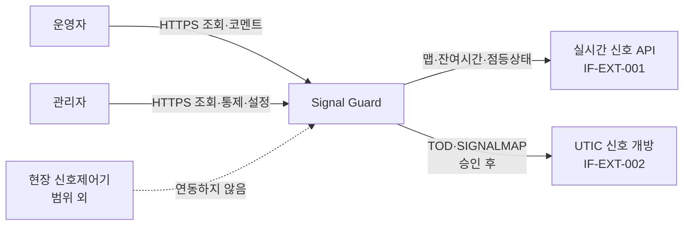
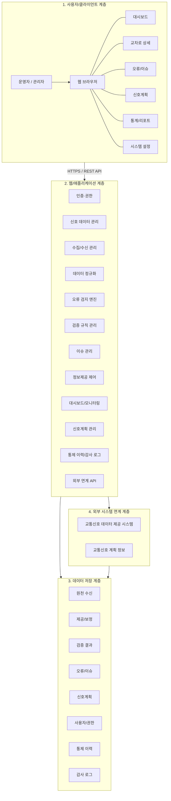
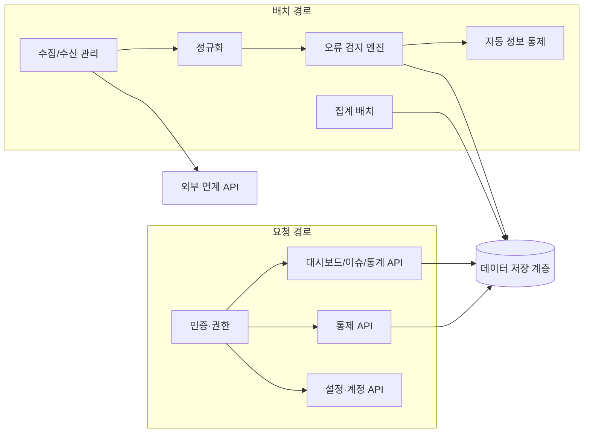
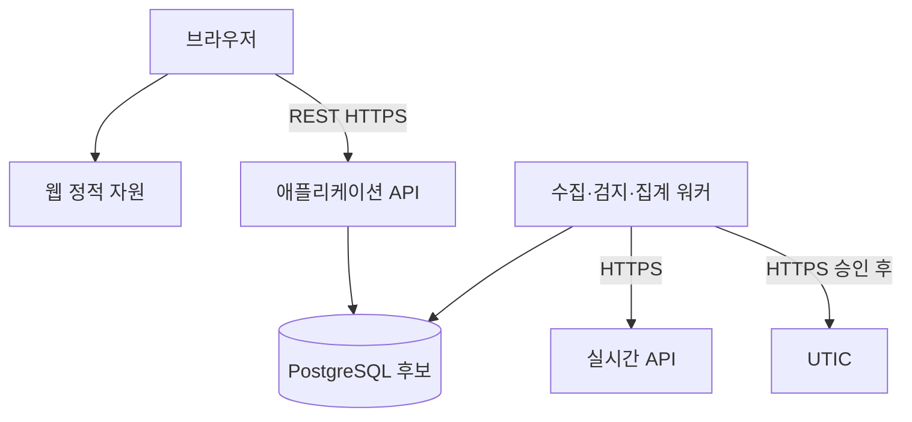
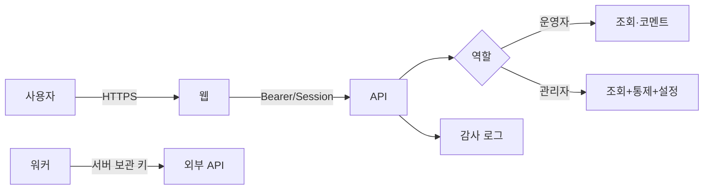
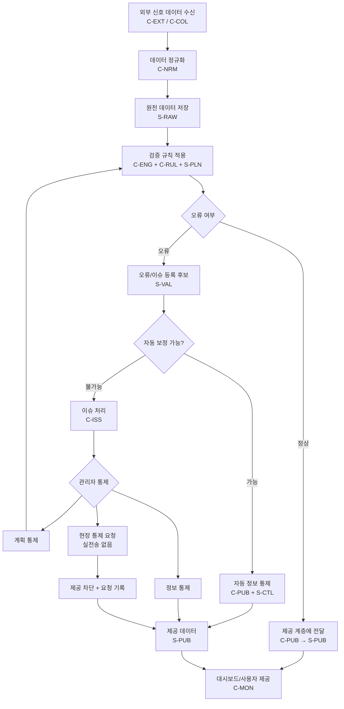

# Signal Guard 시스템 아키텍처

| 항목 | 내용 |
|------|------|
| 문서명 | 실시간 교통신호 상태정보 오류검지 시스템 아키텍처 설계서 |
| 프로젝트 | Signal Guard |
| 버전 | 0.1 |
| 작성일 | 2026-09-19 |
| 작성 | 조찬희 (기획·PM), 기경현 (백엔드·데이터) |
| 단계 | 설계 1주차 (전체 4주, S-D1) |
| 근거 | 프로젝트정의서.md, 요구사항정의서.md, 유스케이스사용자스토리.md, 백로그WBS.md (WBS-3.1), SFR-001 |

---

## 개정 이력

| 버전 | 일자 | 작성 | 변경 내용 |
|------|------|------|-----------|
| 0.1 | 2026-09-19 | 조찬희, 기경현 | 최초 작성. 5계층 논리 구성도(사용자 스케치)를 설계 문서로 전개. 스택·표본 수·수집 주기는 미결로 남김 |

---

## 1. 개요

### 1.1 목적

본 문서는 Signal Guard를 **어떤 계층과 컴포넌트로 나눌지**를 고정한다. 화면설계·ERD·API 명세·검증 규칙 명세는 본 문서의 계층·컴포넌트 ID를 기준으로 상세화한다.

한 줄로 말하면, 본 시스템은 외부에서 받은 신호 데이터를 **검지 → 관제 → 통제**하는 웹 기반 계층이다. 현장 신호제어기를 직접 조작하지 않으며, **원본 수신 데이터는 덮어쓰지 않는다.**

### 1.2 문서 관계

```
요구사항정의서 (무엇을)     유스케이스사용자스토리 (누가·어떻게)
        │                              │
        └──────────────┬───────────────┘
                       ▼
              본 문서 (어떻게 나눌지)     ← 계층·컴포넌트 정본
                       │
        ┌──────────────┼──────────────┐
        ▼              ▼              ▼
   화면IA.md       ERD/데이터      API·규칙 명세
```

| 구분 | 정본 | 본 문서에서 하는 일 |
|------|------|---------------------|
| 기능·수용 기준 | `분석/요구사항정의서.md` | FR/NFR ID를 컴포넌트에 매핑 |
| 유스케이스 | `분석/유스케이스사용자스토리.md` | UC를 계층 흐름에 매핑 |
| 일정 | `백로그WBS.md` | WBS-3.1 산출물. 구현은 6주 이후 |
| 기술 스택 | 설계 5주 게이트 | 후보만 적고 확정하지 않음 |
| 데이터 구조 | `설계/ERD.md` | 논리 엔터티·원본/제공 분리 |
| 화면 IA·와이어 | `설계/화면IA.md` | 1계층 화면 ID·메뉴·구역 |
| 내부 REST | `설계/API명세.md` | IF-INT-001 경로·RBAC |

### 1.3 작성 범위 (설계 1주차)

**포함**

- 시스템 컨텍스트와 경계
- 5계층 논리 구성 (사용자 스케치 정본화)
- 계층별 책임, 컴포넌트, 인터페이스
- 오류 검지·통제 처리 흐름
- 원본 / 제공 계층 분리 원칙
- 논리 배포 구성, 용량 산정식
- 요구사항 추적, 설계 미결

**포함하지 않음 (후속 산출물)**

- 화면 와이어·IA (WBS-3.3)
- 물리 타입 길이·파티션 (논리 ERD는 `설계/ERD.md`)
- REST 경로·요청/응답 스키마 → `설계/API명세.md` (WBS-3.5, 0.1)
- R01~R12 임계 기본값 확정 (WBS-3.6)
- Docker Compose 등 물리 배포 파일 (구현 S1)

### 1.4 용어

요구사항정의서 3장과 같다. 스케치에서 쓴 이름과 공식 용어의 대응만 여기에 둔다.

| 스케치 표현 | 공식 용어 | 비고 |
|-------------|-----------|------|
| 오류 검지 엔진 | 검지 (검증 규칙 엔진) | FR-VAL-* |
| 정보제공 제어 | 정보 통제 | FR-CTL-002. 신호기 조작이 아님 |
| 제어 이력 | 통제 이력 | FR-CTL-005 |
| 원천 수신 데이터 | 원본 수신 | 불변. DAR-N-004 |
| 제공/보정 데이터 | 제공 계층 | 대시보드·(가상) 대외 제공 값 |
| 자동 보정 | 자동 정보 통제 | 제공 계층만 수정 |
| 이슈 처리 | 관제 + 통제 | 관리자가 정보/계획/현장 요청으로 닫음 |

---

## 2. 아키텍처 목표와 원칙

### 2.1 목표

| ID | 목표 | 근거 |
|----|------|------|
| AG-01 | 수집·검지·관제·통제가 한 웹 시스템 안에서 순환한다 | FR-SYS-001, EXT-006 |
| AG-02 | 원본 수신과 제공 값이 항상 구분되어 조회·감사된다 | FR-CTL-001, FR-STO-001 |
| AG-03 | 해결 가능 오류는 시스템이, 해결 불가 오류는 관리자가 닫는다 | FR-VAL-005, FR-VAL-006 |
| AG-04 | 현장 신호제어기에는 점등·주기 명령을 보내지 않는다 | CON-003, FR-CTL-004 |
| AG-05 | 실시간 API 일 5,000회를 넘지 않는다 | FR-COL-005 |
| AG-06 | 수집·검증이 화면 조회를 막지 않고, 표본 규모에서 3초 내 응답한다 | NFR-PER-001, NFR-PER-002 |
| AG-07 | 교차로 수는 설정으로 늘릴 수 있다 | FR-SYS-002 |

### 2.2 설계 원칙

| 원칙 | 적용 |
|------|------|
| 계층 분리 | 클라이언트, 애플리케이션, 저장, 외부 연계를 섞지 않는다. 브라우저가 외부 API를 직접 호출하지 않는다 |
| 원본 불변 | 보정·통제 경로에 원본 UPDATE/DELETE가 없다. 원본은 append-only |
| 제공 계층 단일 출처 | 대시보드 기본 표시는 제공 계층이다. UI 타이머 추정도 원본을 바꾸지 않는다 |
| 규칙의 설정화 | 임계값(초, 횟수, 등급)은 코드 하드코딩이 아니라 설정 테이블 | FR-VAL-001 |
| 실패 격리 | 외부 API 장애 시 웹은 기동을 유지하고, 실패 교차로만 기록·재시도한다 | NFR-QUR-001, FR-COL-003 |
| 권한의 서버 강제 | 화면에서 버튼을 숨기는 것으로 끝내지 않는다. 통제 API는 관리자만 | NFR-SEC-001 |
| 기술 중립 (1주차) | 컴포넌트는 역할로 정의한다. 프레임워크는 5주 게이트에서 고정한다 | CON-005 |

### 2.3 품질 속성 우선순위

수업 MVP에서 동시에 최대로 끌어올릴 수 있는 속성은 제한된다. 트레이드오프 순서는 아래와 같다.

1. **정확성·감사 가능성** — 원본 보존, 규칙 ID, 통제 전후 값
2. **운영 가시성** — 등급·지연·미처리 이슈를 한 화면
3. **안전 경계** — 신호기 실제어 없음, 쿼터 준수
4. **응답 시간** — 표본 규모 3초 (전국 전수는 범위 외)
5. **확장성** — 설정으로 교차로 수 증가. 수평 확장은 2단계

---

## 3. 시스템 컨텍스트와 경계

### 3.1 컨텍스트

Signal Guard는 센터·공공 API가 **이미 수집·개방 중인 데이터**를 받아, 품질을 검지하고 제공 정보·계획을 통제하는 계층이다.



| 액터 | 관계 | 방향 |
|------|------|------|
| 운영자 | 대시보드·오류·통계 조회, 이슈 코멘트 | 브라우저 → Signal Guard |
| 관리자 | 운영자 권한 + 정보/계획 통제, 현장 통제 요청, 계정·임계값·수집 대상 | 브라우저 → Signal Guard |
| 실시간 API | 교차로 맵, 8방향 잔여시간·점등상태. 일 5,000회 | Signal Guard → 외부 |
| UTIC | TOD·SIGNALMAP·기반정보. 승인 대기 | Signal Guard → 외부 (조건부) |
| 현장 신호제어기 | **경계 밖.** 실전송 인터페이스를 구현하지 않는다 | 없음 |

### 3.2 시스템 안 / 밖

```
외부 API 원본 ──► [검지] 검증·분류 ──► [관제] 대시보드·이슈
                         │
                         ▼
                   [통제] 오류 닫기
              ┌──────────┼──────────┐
              ▼          ▼          ▼
         정보 통제    계획 통제   현장 통제 요청
         (제공계층)   (TOD 등)   (명령 기록만)
              │          │          │
              └──────────┴──────────┘
                    원본 수신은 불변
```

| 구분 | 예 |
|------|----|
| 시스템 안 | 수집 스케줄러, 정규화, 규칙 엔진, 이슈, 대시보드, 제공 계층, 감사 로그 |
| 시스템 밖 | 공공데이터포털, UTIC, 실제 등화기, 민간 내비 서비스, 경찰청 메타데이터 시스템 |
| 가상 대외 제공 | 수업에서는 별도 대외 API를 구축하지 않는다. 제공 계층 값이 “운전자에게 나갔을 값”의 대리다 |

### 3.3 수업 MVP 제약 (아키텍처에 반영)

| 제약 | 아키텍처 대응 |
|------|----------------|
| 인천시 표본, 전국 2,425개소 제외 | 수집 대상은 설정 집합. 스케줄러가 전수 폴링하지 않음 |
| 일 5,000건 | 쿼터 가드 컴포넌트가 호출 전에 차단 |
| UTIC 미승인 가능 | 계획 적재가 UTIC / 수동 / 추정 / 시드 어댑터를 가짐 |
| 15주, 팀 2명 | 단일 웹앱 + API + DB + 스케줄러. 메시지 버스·MSA는 쓰지 않음 |
| 실시간 데이터는 참고용 | 검지 대상이지 현장 안전 제어 입력이 아님 |

---

## 4. 논리 구성 — 5계층

사용자 스케치를 설계 정본으로 둔다. 계층 번호는 스케치와 같다.



계층 5는 런타임 파이프라인이므로 구성도가 아니라 **처리 흐름**이다. 13장에서 전개한다.

| 계층 | 역할 | 주 액터 |
|------|------|---------|
| 1. 사용자/클라이언트 | 관제 화면. 데이터 가공의 주체가 아님 | 운영자, 관리자 |
| 2. 웹/애플리케이션 | 인증, 수집, 검지, 관제 API, 통제 | 시스템 + 사용자 요청 |
| 3. 데이터 저장 | 원본/제공/계획/이슈/이력 분리 저장 | — |
| 4. 외부 연계 | 실시간 API, UTIC(또는 대체) | 시스템 |
| 5. 오류 검지 처리 흐름 | 수신 → 정규화 → 검증 → 분기 → 제공 | 시스템, 관리자 |

---

## 5. 1계층 — 사용자/클라이언트

### 5.1 책임

- HTTPS로 웹 앱에 접속하고 REST API만 호출한다.
- 외부 신호 API 키를 브라우저에 두지 않는다.
- 역할에 따라 메뉴와 통제 버튼이 달라진다. **최종 거부는 서버**가 한다.

### 5.2 역할과 화면

| 화면 | 운영자 | 관리자 | 관련 요구 |
|------|--------|--------|-----------|
| 로그인 | ○ | ○ | FR-ADM-001 |
| 종합 대시보드 | ○ | ○ | FR-MON-001 |
| 교차로 상세 | ○ | ○ | FR-MON-002 |
| 오류/이슈 조회 | ○ | ○ | FR-MON-003 |
| 이슈 코멘트 | ○ | ○ | FR-ISS-002 |
| 이슈 상태 변경·통제 | × | ○ | FR-ISS-003, FR-CTL-002~004 |
| 신호계획 조회 | ○ | ○ | FR-MON-005 |
| 신호계획 수정 | × | ○ | FR-CTL-003 |
| 통계/리포트·CSV | ○ | ○ | FR-MON-004 |
| 통제 이력 | ○ 조회 | ○ 조회 | FR-CTL-005 |
| 시스템 설정·계정 | × | ○ | FR-ADM-001, FR-ADM-002 |

### 5.3 클라이언트 설계 메모 (1주차)

| 항목 | 결정 | 비고 |
|------|------|------|
| 형태 | SPA 웹 애플리케이션 | HTML5, 데스크톱 밀도 우선, 기본 반응형 |
| 통신 | REST. 실시간 갱신은 **폴링을 1차 기본** | 웹소켓은 선택(FR-MON-003-1, 미결 4) |
| 지도 | 1차 미포함 가능 | FR-MON-006, 미결 5 |
| 잔여시간 UX | 수집 공백 시 UI 타이머로 1초 감소 | 추정임을 표시. 원본 불변 | NFR-USA-002 |

화면 IA·와이어는 본 문서가 아니라 `설계/화면IA.md`(WBS-3.3)가 정본이다.

---

## 6. 2계층 — 웹/애플리케이션

애플리케이션 계층은 **요청을 처리하는 API**와 **주기적으로 도는 작업**으로 나눈다. 둘은 같은 저장 계층을 쓰되, 수집·검증이 HTTP 워커를 장시간 점유하지 않게 분리한다 (NFR-PER-002).



### 6.1 컴포넌트 목록

스케치 모듈을 컴포넌트 ID로 고정한다. 구현 시 패키지/모듈 이름의 출발점이다.

| ID | 스케치 모듈 | 책임 | 경로 | 주요 FR / UC |
|----|-------------|------|------|--------------|
| C-AUTH | 사용자 인증 및 권한 관리 | 로그인, 세션/토큰, RBAC, 비밀번호 해시 | 요청 | FR-ADM-001, UC09 |
| C-SIG | 신호 데이터 관리 | 교차로 마스터, 실시간 상태 조회, 이력 | 요청+배치 | FR-STO-001, FR-MON-002 |
| C-COL | 데이터 수집/수신 관리 | 스케줄, 재시도, 부분 실패 우선, 쿼터 가드 | 배치 | FR-COL-001~005, UC01 |
| C-NRM | 데이터 정규화 | JSON→내부 모델, 센티초→초, 점등 코드 매핑 | 배치 | FR-COL-004 |
| C-ENG | 오류 검지 엔진 | R01~R12 적용, 등급, 해결가능/불가 분기 | 배치 | FR-VAL-001~006, UC03 |
| C-RUL | 검증 규칙 관리 | 임계값·등급 승격 설정 읽기/쓰기 | 요청 | FR-VAL-001, FR-ADM-002, UC10 |
| C-ISS | 이슈 관리 | 등록·중복 갱신, 상태 전이, 담당·코멘트 | 요청+배치 | FR-ISS-001~004, UC05, UC07 |
| C-PUB | 정보제공 제어 | 제공 값 대체, 제공 차단, UI 타이머용 추정 | 요청+배치 | FR-CTL-002, UC04, UC07 |
| C-MON | 대시보드/모니터링 서비스 | 지표 집계 조회, 오류 목록, 교차로 상세 | 요청 | FR-MON-001~003, UC06 |
| C-PLN | 신호계획 관리 | 계획 CRUD, 출처 관리, ID 매핑, 재검증 트리거 | 요청+배치 | FR-PLN-001~004, UC02 |
| C-RPT | 통계/리포트 서비스 | 사전 집계 조회, CSV | 요청 | FR-MON-004, UC08 |
| C-AUD | 통제 이력/감사 로그 관리 | 통제 전후 값, 로그인 실패, 권한 거부 | 요청+배치 | FR-CTL-005, NFR-SEC-003, UC11 |
| C-EXT | 외부 시스템 연계 API | 실시간·UTIC 어댑터, 타임아웃, 결과코드 해석 | 배치 | IF-EXT-001, IF-EXT-002 |
| C-AGG | (스케치 외) 집계 배치 | 시간/일/주/월 통계 테이블 생성 | 배치 | FR-STO-003 |

C-AGG는 스케치에 상자가 없으나 SFR-003·PER-004를 만족하려면 애플리케이션 계층에 필요하다.

### 6.2 컴포넌트 상세

#### C-AUTH 인증·권한

- 역할: `OPERATOR`, `ADMIN` (요구사항의 운영자·관리자).
- 보호된 화면/API는 인증 필수. 운영자 토큰으로 통제 API 호출 시 403.
- 비밀번호는 복호화 불가능한 해시. API 키(`serviceKey`)는 서버 환경 변수, 저장소 커밋 금지.

#### C-COL 수집/수신 관리

- 교차로 맵(`/crsrd_map_info`)은 상태보다 **드물게**.
- 상태(`/tl_drct_info`)는 표본 집합만 **일정 간격 배치**.
- 호출 전에 당일 카운트를 보고 한도 근접 시 중단 (C-COL 내부 쿼터 가드).
- 실패(타임아웃, 5xx, `SERVICETIMEOUT_ERROR`) 시 재시도. 부분 실패 교차로는 다음 주기 우선.
- API 시각과 별도로 **시스템 수신 시각**을 붙인다.

#### C-NRM 정규화

- 원본 페이로드(또는 원본 필드)를 먼저 원천 저장한 뒤, 정규화 레코드를 만든다. 순서가 바뀌면 원본 불변이 깨지기 쉽다.
- `...RmndCs` 18000 → 180초.
- 점등상태 별칭·공백·대소문자 → 표준 코드. 실패는 R12.

#### C-ENG 오류 검지 엔진

입력: 정규화 상태 + (매핑된 경우) 해당 시각 계획 + 직전 정상 프레임 + 설정 임계값.

출력: 규칙별 `validation_result`, 최고 등급, 분기 코드.

| 분기 | 조건 | 다음 컴포넌트 |
|------|------|----------------|
| 정상 | 규칙 위반 없음 | C-PUB — 제공 계층에 정규화 값 반영 |
| 해결 가능 | R08 중복, R12 매핑, 경미 R02, 정렬 가능 R09, 단일 결측 보간 등 | C-PUB 자동 정보 통제 + C-AUD 로그. 등급 INFO |
| 해결 불가 | 계획 지속 불일치, R05, R06, 급변 반복, 장시간 미수신, 자동보정 실패·단기 반복 | C-ISS 이슈 OPEN/갱신 |
| 계획 대조 생략 | ID 미매핑 | 상태 품질 규칙만 실행 |

규칙은 코드에 존재하되 **임계값은 C-RUL 설정**을 읽는다.

#### C-PUB 정보제공 제어

제공 계층에만 쓴다.

| 모드 | 누가 | 동작 |
|------|------|------|
| 통과 | 시스템 | 정규화 값을 제공 값으로 복사 |
| 자동 보정 | 시스템 | 중복 제거, 코드 매핑, 공백 타이머(모순 없을 때), 단일 결측 보간 |
| 수동 대체 | 관리자 | 제공 값 수정 |
| 제공 차단 | 시스템 또는 관리자 | 해당 교차로·방향을 “제공 중지”. R06 시 기본 차단 |
| UI 추정 | 클라이언트+제공 플래그 | 표시용 1초 감소. 저장 원본 불변 |

#### C-ISS 이슈 관리

상태: `OPEN → ACK → IN_PROGRESS → RESOLVED → CLOSED`. 오탐은 `FALSE_POSITIVE`.

동일 교차로·규칙·미종료 이슈가 있으면 신규 생성하지 않고 갱신한다.

#### C-PLN 신호계획 관리

내부 계획은 출처와 무관하게 같은 스키마다.

우선순위: (1) UTIC (2) 운영자 등록 (3) 최근 정상 주기 추정 (4) 시드.

`INT_NO` ↔ `crsrdId` 매핑은 이름·좌표 후보 제시 후 관리자 확정. 미매핑은 계획 대조를 하지 않는다.

#### C-EXT 외부 연계

브라우저가 아니라 서버만 호출한다. 어댑터는 외부 스키마를 내부 명령으로 바꾸고, 내부 오류 코드로 정규화한다.

현장 신호기 어댑터는 **만들지 않는다.** 현장 통제 요청은 C-ISS/C-AUD에 기록만 한다.

### 6.3 컴포넌트 의존

```
C-EXT ← C-COL → C-NRM → C-ENG → C-PUB
                          │  └→ C-ISS
                          │
C-PLN ────────────────────┘
C-RUL ────────────────────┘
C-AUTH → C-MON, C-RPT, C-ISS, C-PLN, C-PUB, C-AUD, C-RUL
C-ENG / C-PUB / 통제 API → C-AUD
C-AGG ← 검증·이슈 이력
```

순환 의존을 피한다. 엔진은 화면 서비스를 호출하지 않고 DB에 쓴다. 대시보드는 DB(또는 조회 서비스)를 읽는다.

---

## 7. 3계층 — 데이터 저장

상세 컬럼은 ERD(WBS-3.4)가 정본이다. 여기서는 **저장소가 나눠 담아야 하는 정보 집합**만 고정한다.

### 7.1 저장 집합

| ID | 스케치 | 담는 것 | 변경 규칙 |
|----|--------|---------|-----------|
| S-RAW | 원천 수신 데이터 | `/tl_drct_info` 원시, 수신 시각, 교차로, 원본 잔여시간(센티초) 등 | **추가만.** 통제 경로에서 UPDATE/DELETE 금지 |
| S-MAP | (교차로 마스터) | crsrdId, 명칭, 지자체, 좌표 | 맵 수집 주기로 갱신. 상태 원본이 아님 |
| S-PUB | 제공/보정 데이터 | 초 단위 잔여시간, 표준 점등, 제공 차단 여부, 마지막 통제 ID | 자동/수동 정보 통제로 변경 가능 |
| S-VAL | 검증 결과 | 규칙 ID, 등급, 시각, 교차로·방향, 판정 요약 | 이벤트 append |
| S-ISS | 오류/이슈 정보 | 이슈 헤더 + 상태 이력 | 상태 전이만. 원본 필드 복사본은 불변 스냅샷 |
| S-PLN | 신호계획 정보 | TOD 구간, 현시 순서, 유지시간, 사이클, 출처, ID 매핑 | 관리자 계획 통제·UTIC 적재로 변경. 상태 원본과 별개 |
| S-USR | 사용자/권한 정보 | 계정, 역할, 비밀번호 해시 | 관리자만 |
| S-CTL | 제어(통제) 이력 | AUTO_INFO / MANUAL_INFO / PLAN_UPDATE / PUBLISH_BLOCK / FIELD_REQUEST, 전후 값, 액터 | append-only |
| S-AUD | 감사 로그 | 로그인 실패, 403, 설정 변경, 이슈 상태 변경 | append-only |
| S-STA | (스케치 외) 집계 | 시간·일·주·월, 교차로·규칙·등급 | 배치가 재생성 |

스케치의 “신호계획 / 사용자 / 제어 이력 / 감사 로그”는 원천·제공과 **같은 데이터베이스 안의 다른 집합**이다. 물리적으로 다른 서버일 필요는 없다.

### 7.2 원본 vs 제공 (핵심 불변식)

```
수집 1건
  ├─ S-RAW   수신 당시 값     ← 이후 어떤 컴포넌트도 수정하지 않음
  ├─ S-PUB   검지·통제 후 값  ← 대시보드 기본 표시
  ├─ S-VAL   규칙 판정
  └─ S-CTL   값이 바뀐 이유
```

교차로 상세(FR-MON-002, FR-CTL-001)는 S-RAW와 S-PUB를 **나란히** 보여 준다. 제공 값이 바뀌어도 S-RAW 행의 해시는 동일해야 한다.

### 7.3 논리 엔터티 초안 (프로젝트정의서 9.2와 정합)

구현 테이블명은 ERD에서 확정한다.

| 엔터티 | 저장 집합 |
|--------|-----------|
| `intersection` | S-MAP |
| `intersection_id_map` | S-PLN |
| `signal_plan` / `signal_plan_phase` | S-PLN |
| `signal_status_raw` | S-RAW |
| `signal_status` (제공) | S-PUB |
| `validation_result` | S-VAL |
| `auto_correction_log` / `control_log` | S-CTL |
| `field_control_request` | S-CTL (실전송=아니오) |
| `issue` / `issue_history` | S-ISS |
| `stat_hourly` 등 | S-STA |
| `app_user` / `role` | S-USR |
| `rule_threshold` / `collection_config` | 설정 (C-RUL, C-COL) |
| `audit_log` | S-AUD |

### 7.4 보관 주기 (논리)

| 계층 | 주기 | 용도 |
|------|------|------|
| 실시간 원시 | 상태 배치마다 | 재검증·감사 |
| 교차로 맵 | 상태보다 드물게 | 마스터 |
| UTIC 계획 | 일 1회 또는 변경 시 | 기대값 원본 |
| 제공 상태 | 배치마다 | 현재 관제 값 |
| 검증·통제 로그 | 이벤트 시 | 추적 |
| 이슈 | 발생/변경 시 | 관제 |
| 집계 | 시간/일/주/월 | 3초 통계 |

보관 기간의 숫자는 용량 산정(12장)과 함께 5주 게이트에서 확정한다.

---

## 8. 4계층 — 외부 시스템 연계

### 8.1 교통신호 데이터 제공 시스템 (IF-EXT-001)

| 항목 | 내용 |
|------|------|
| 서비스 | 공공데이터포털 교통안전 신호등 실시간 정보 |
| Base URL | `https://apis.data.go.kr/B551982/rti` |
| 기능 | `/crsrd_map_info`, `/tl_drct_info` |
| 인증 | Decoding `serviceKey` (서버만 보유) |
| 제약 | HTTPS, 개발계정 일 5,000회 |
| 정상 | `header.resultCode = K0` |
| 장애 | HTTP 504, `SERVICETIMEOUT_ERROR`, SSL/연결 타임아웃 |
| 내부 컴포넌트 | C-EXT → C-COL |

실시간 정보는 제공기관이 **참고용**이라고 명시한 데이터다. 본 시스템은 그 지연·불일치를 검지한다. 운영·안전 제어 입력으로 쓰지 않는다.

### 8.2 교통신호 계획 정보 (IF-EXT-002)

| 항목 | 내용 |
|------|------|
| 서비스 | UTIC 신호 개방 데이터 (경찰청·한국도로교통공단) |
| 제공 | 교차로 기반, 현시구성, TOD(운영·평일·특수일·예약), SIGNALMAP |
| 갱신 | 일 1회 또는 변경 시 |
| 상태 | **승인 대기** |
| 내부 컴포넌트 | C-EXT → C-PLN |

승인 전에는 C-PLN이 외부 호출 없이 수동/추정/시드로 동일 스키마를 채운다. 미승인은 결함이 아니다 (FR-PLN-002).

### 8.3 조인과 매핑

| 실시간 | UTIC | 방법 |
|--------|------|------|
| `crsrdId`, `crsrdNm`, `lclgvNm`, 위·경도 | `REGION_CD`, `INT_NO`, `INT_NM`, 좌표 | `intersection_id_map`. 자동 후보 + 관리자 확정 |

인천(`lclgvNm`) 필터는 맵 수집 단계의 책임이다.

### 8.4 명시적으로 없는 연계

- 현장 신호제어기 원격 점등·주기 API
- 경찰청 메타데이터관리시스템
- 센터 내부망 전용 회선
- 민간 내비/앱으로의 실제 정보 배포 API

현장 통제 요청(FR-CTL-004)은 위 API를 **시뮬레이션·기록**할 뿐 호출하지 않는다. 테스트 수용 기준: R06 처리 시 외부 신호기 HTTP 0건.

---

## 9. 런타임 컨테이너 (논리 배포)

물리 서버 대수·클라우드 상품은 수업 범위에서 중요하지 않다. **프로세스 역할**만 나눈다.



| 컨테이너 | 하는 일 | 비고 |
|----------|---------|------|
| 웹 클라이언트 | 화면, 폴링, UI 타이머 | React 또는 Vue 후보 |
| API 프로세스 | C-AUTH, 조회, 통제, 설정 | Spring Boot 또는 Node.js 후보 |
| 워커 프로세스 | C-COL, C-NRM, C-ENG, C-AGG | API와 프로세스 분리 권장. 수업에서는 동일 앱의 스케줄러 스레드여도 됨. 단, 요청 스레드를 막지 말 것 |
| 데이터베이스 | 3계층 전체 | 수업 MVP는 RDB 1식. 권장 PostgreSQL |

메시지 큐, 검색 엔진, 별도 캐시 클러스터는 **1차 아키텍처에 넣지 않는다.** 통계는 사전 집계 테이블로 3초를 맞춘다.

### 9.1 기술 후보 (미확정)

프로젝트정의서 9.1과 같다. 5주 게이트에서 한 줄로 고른다.

| 구분 | 후보 | 아키텍처 제약 |
|------|------|----------------|
| Frontend | React 또는 Vue | Chart.js(또는 동등), REST, (선택) WebSocket |
| Backend | Spring Boot 또는 Node.js | REST, 스케줄러, 환경 변수 시크릿 |
| Data | PostgreSQL | 원본/제공 테이블 분리 |
| DevOps | Git/GitHub, Docker | 시크릿 미커밋 |

스택이 바뀌어도 **계층·컴포넌트 ID는 유지**한다.

---

## 10. 인터페이스

### 10.1 내부 REST (IF-INT-001)

경로·스키마 정본은 `설계/API명세.md`(WBS-3.5)다. 아래는 영역 요약이다.

| 영역 | 메서드 성격 | 최소 역할 | 컴포넌트 |
|------|-------------|-----------|----------|
| 인증 | 로그인·로그아웃 | 전체 | C-AUTH |
| 대시보드 지표 | GET | 운영자 | C-MON |
| 교차로 상세·이력 | GET | 운영자 | C-MON, C-SIG |
| 원본/제공 병기 | GET | 운영자 | C-SIG, C-PUB |
| 이슈 목록·상세 | GET | 운영자 | C-ISS |
| 이슈 상태·코멘트 | POST/PATCH | 코멘트=운영자, 전이·통제=관리자 | C-ISS |
| 정보 통제·제공 차단 | POST | 관리자 | C-PUB |
| 계획 조회 | GET | 운영자 | C-PLN |
| 계획 수정·매핑 확정 | PUT/POST | 관리자 | C-PLN |
| 현장 통제 요청 | POST | 관리자 | C-ISS, C-AUD |
| 통계·CSV | GET | 운영자 | C-RPT |
| 설정·계정·임계값·수집 대상 | CRUD | 관리자 | C-AUTH, C-RUL, C-COL |
| 쿼터 사용량 | GET | 관리자 (대시보드 표시는 운영자도) | C-COL |
| 헬스체크 | GET | 인증 여부는 구현에서 결정 | — |

공통: JSON, HTTPS, 권한 오류 403, 입력 서버 검증.

### 10.2 실시간 푸시 (선택)

미구현 시 클라이언트가 대시보드·이슈 목록을 설정 주기로 GET 한다. 푸시를 넣어도 저장 계층과 검지 파이프라인은 변하지 않는다.

---

## 11. 보안 아키텍처 (수업 범위)

센터 반입·보안 특약·내부망은 문서 대응만 한다. 구현 보안은 아래만 아키텍처에 넣는다.



| 통제 | 방법 |
|------|------|
| 전송 | HTTPS |
| 인증 | 로그인 세션 또는 토큰, 만료 |
| 인가 | RBAC. 통제·계정·임계값은 ADMIN |
| 비밀 | 비밀번호 해시, `serviceKey` 환경 변수 |
| 입력 | 서버 측 검증 |
| 감사 | 로그인 실패, 403, 값/계획 수정 전후, 이슈 전이 |
| 범위 외 | 현장 제어 채널, 센터 특약 |

현장 신호기 제어용 키를 설계에 두지 않는 것 자체가 보안 결정이다 (NFR-SEC-001).

---

## 12. 용량 산정 (초안)

확정 숫자(표본 수 N, 주기 T분, 보관 D일)는 미결 2번이다. 여기서는 **산정식**만 고정한다 (FR-SYS-002, NFR-PER-003).

### 12.1 호출량

실시간 상태 호출을 교차로당 1회/주기로 보면:

\[
호출_{일} \approx \frac{1440}{T} \times N + 맵수집_{일}
\]

조건: \(호출_{일} \le 5000\).

UTIC는 일 1회라 실시간 쿼터와 별개로 본다.

| 가정 예 (미확정) | N | T(분) | 상태 호출/일 | 판정 |
|------------------|---|-------|--------------|------|
| 여유 | 20 | 10 | 2,880 | 가능 |
| 중간 | 30 | 15 | 2,880 | 가능 |
| 타이트 | 50 | 15 | 4,800 | 맵 호출 포함 시 위험 |
| 불가 예 | 50 | 5 | 14,400 | 쿼터 초과. 채택 금지 |

초단위 전수 폴링은 산정식에 넣지 않는다.

### 12.2 저장량 (개략)

상태 원본 1건 크기 \(B_{raw}\) 바이트, 제공 1건 \(B_{pub}\), 일일 상태 건수 \(C = (1440/T)\times N\).

\[
저장_{상태} \approx C \times (B_{raw}+B_{pub}) \times D
\]

검증·이슈·로그는 오류 발생률에 비례하므로, 설계 리뷰 시 “전 건 검증 로그를 D일 보관”인지 “이슈만 장기 보관”인지를 고른다. 수업 규모에서는 단일 PostgreSQL로 충분하다는 전제를 둔다.

5주차에 N, T, D, \(B\) 가정과 디스크 여유를 표로 확정한다.

---

## 13. 5계층 — 오류 검지 처리 흐름

스케치의 파이프라인을 컴포넌트·데이터 집합·통제 갈래까지 풀어 쓴다.

### 13.1 배치 파이프라인 (UC01 → UC03 → UC04/UC05)



스케치의 “이슈 처리 → 제공 데이터”는, 요구사항상 **세 갈래 통제 후** 제공 계층이 갱신되는 것으로 읽는다. 이슈만 만들고 제공 값을 그대로 두면 틀린 정보가 화면에 남는다. R06 등 CRITICAL은 이슈와 동시에 제공 차단이 기본이다.

### 13.2 단계별 입출력

| 단계 | 입력 | 출력 | 실패 시 |
|------|------|------|---------|
| 수신 | 표본 교차로 ID, 쿼터 잔량 | 원본 JSON, HTTP 결과 | 재시도, 실패 목록, 수신 품질 규칙(R07) |
| 정규화 | 원본 JSON | 내부 상태 모델(초, 표준 코드) | R12, 매핑 가능하면 자동 보정 |
| 원천 저장 | 원본 + 수신 시각 | S-RAW 행 | 저장 실패 시 해당 주기 중단·로그. 부분 커밋 정책은 ERD에서 확정 |
| 검증 | 정규화 상태, 계획, 직전 프레임, 임계값 | S-VAL, 분기 | 엔진 예외는 NFR-QUR-001. 웹은 유지 |
| 정상 | 정규화 값 | S-PUB | — |
| 자동 보정 | 규칙 ID, 전 값 | S-PUB, S-CTL(AUTO_INFO), INFO | 실패 또는 단기 반복 → 이슈 |
| 이슈 | 교차로·규칙·등급·스냅샷 | S-ISS OPEN 또는 갱신 | 중복 생성 금지 |
| 제공 | S-PUB | 대시보드 GET | 차단 시 “제공 중지” 표시 |

### 13.3 정상 시나리오

1. 워커가 쿼터 잔량을 확인한다.
2. 표본 교차로 맵(필요 시)·상태를 수집한다.
3. S-RAW에 원본을 남긴다.
4. 센티초·코드를 정규화한다.
5. 매핑된 교차로는 해당 시각 TOD·현시와 조인한다. 미매핑은 상태 품질만 본다.
6. R01~R12를 적용하고 등급을 붙인다.
7. 위반이 없으면 S-PUB를 갱신한다.
8. 운영자가 대시보드에서 정상 건수를 본다.

### 13.4 해결 가능 오류 (자동 정보 통제)

대상 예: 동의어 코드, 공백, 중복 페이로드, 수 초 시각 어긋남, 단일 필드 결측, 계획과 모순 없는 공백 타이머.

- S-RAW는 그대로다.
- S-PUB만 고치고 S-CTL에 규칙 ID, 전/후, 시각, 신뢰도를 남긴다.
- 대시보드 “자동보정 N건”은 S-CTL의 AUTO_INFO 집계다.
- 같은 규칙이 짧은 시간에 반복되면 자동 통제를 멈추고 이슈로 승격한다.

### 13.5 해결 불가 오류 (이슈·통제)

| 오류 위치 | 예 | 통제 |
|-----------|----|------|
| 제공 정보 | 급변한 잔여시간이 서비스 값으로 나감 | 정보 통제: 대체·차단·추정 표시 |
| 계획 | TOD가 틀려 계속 불일치 | 계획 통제 후 재검증 |
| 현장 등화 | 충돌 녹색(R06) | 제공 차단 + 현장 통제 요청 기록. 신호기 HTTP 없음 |

이슈 생명주기: 관리자가 ACK → 조치 → RESOLVED → CLOSED. 운영자는 조회·코멘트만.

### 13.6 관제 루프 (사람)

```
대시보드에서 등급·미처리 이슈 확인
        → 교차로 상세에서 원본 vs 제공 비교
        → 이슈 상세에서 규칙·추정 원인 확인
        → 정보 / 계획 / 현장 요청 중 선택
        → 재검증 또는 제공 차단 상태 확인
        → 이슈 종료
        → 통계로 반복 교차로·규칙 우선순위
```

### 13.7 예외가 파이프라인에 미치는 영향

| 예외 | 파이프라인 |
|------|------------|
| API 504/타임아웃 | 해당 주기 실패 기록, 다음 주기 우선 수집. 연속 실패는 R07 |
| 쿼터 근접 | 신규 외부 호출 중단. 마지막 S-PUB + UI 타이머. 대시보드 경고 |
| UTIC 미승인 | 계획 어댑터만 대체. 이후 단계는 동일 |
| ID 미매핑 | D단계에서 계획 규칙(R05, R10 등) 스킵 |
| 감시 제외 | 해당 교차로 신규 이슈 억제 (FR-ISS-004, 중요) |
| 권한 없는 통제 | API 거부 + S-AUD. 파이프라인 불변 |

---

## 14. 유스케이스와 계층 매핑

| UC | 주 경로 | 계층 |
|----|---------|------|
| UC01 수집·정규화 | C-COL → C-NRM → S-RAW/S-PUB 초안 | 2, 3, 4, 5 |
| UC02 계획 적재 | C-EXT/C-PLN → S-PLN | 2, 3, 4 |
| UC03 대조·판정 | C-ENG → S-VAL | 2, 3, 5 |
| UC04 자동 정보 통제 | C-PUB → S-PUB, S-CTL | 2, 3, 5 |
| UC05 이슈 등록 | C-ISS → S-ISS | 2, 3, 5 |
| UC06 대시보드 관제 | 1계층 → C-MON | 1, 2, 3 |
| UC07 관리자 통제 | C-PUB / C-PLN / C-ISS | 1, 2, 3, 5 |
| UC08 통계 | C-AGG → C-RPT | 1, 2, 3 |
| UC09 계정 | C-AUTH | 1, 2, 3 |
| UC10 수집·임계 설정 | C-COL, C-RUL | 1, 2, 3 |
| UC11 통제 이력·원본 병기 | C-AUD, C-SIG | 1, 2, 3 |

---

## 15. 요구사항 추적

### 15.1 기능

| 요구 | 아키텍처 위치 |
|------|----------------|
| FR-SYS-001 | 5계층 + API/워커/DB 컨테이너 |
| FR-SYS-002 | C-COL 수집 대상 설정, 12장 산정식 |
| FR-COL-001~005 | C-COL, C-EXT, C-NRM |
| FR-PLN-001~004 | C-PLN, S-PLN, IF-EXT-002 |
| FR-STO-001~003 | 7장 저장 집합, C-AGG |
| FR-VAL-001~006, R01~R12 | C-ENG, C-RUL, 13장 |
| FR-ISS-001~004 | C-ISS |
| FR-CTL-001~005 | S-RAW/S-PUB 분리, C-PUB, C-PLN, 현장 요청 기록 |
| FR-MON-001~005 | 1계층 화면, C-MON, C-RPT, C-PLN |
| FR-MON-003-1, FR-MON-006 | 선택. 컨테이너에 필수 아님 |
| FR-ADM-001~002 | C-AUTH, C-RUL, C-COL |

### 15.2 비기능

| 요구 | 아키텍처 대응 |
|------|----------------|
| NFR-PER-001 | 조회는 집계·인덱스. 통계는 S-STA |
| NFR-PER-002 | 워커와 API 분리 |
| NFR-PER-003 | 12장 산정식 |
| NFR-SEC-001~003 | 11장 |
| NFR-QUR-001~002 | C-EXT 타임아웃, 프로세스 재시작 후 스케줄 재개 |
| NFR-USA-001~002 | SPA, UI 타이머 플래그 |
| CON-003, CON-006 | 4계층에 신호기 없음, S-RAW 불변 |

### 15.3 SFR-001 산출

본 문서의 4장 구성도, 9장 컨테이너, 12장 산정식이 SFR-001이 요구하는 시스템 구성도·용량 설계의 1주차 산출이다. 숫자 확정본은 5주 설계 리뷰에서 버전을 올려 붙인다.

---

## 16. 설계 결정과 미결

### 16.1 이번에 고정한 것

1. 논리 계층은 사용자 스케치의 5계층을 따른다.
2. 애플리케이션은 요청 경로와 배치 경로를 나눈다.
3. 원본(S-RAW)과 제공(S-PUB)을 저장 집합 수준에서 분리한다.
4. 자동 보정은 정보 통제의 자동 경로이며, 원본을 수정하지 않는다.
5. 해결 불가 오류의 닫기는 정보 통제 / 계획 통제 / 현장 통제 요청 세 갈래다.
6. 현장 신호제어기 어댑터는 아키텍처에 존재하지 않는다.
7. 외부 API는 서버 워커만 호출한다.
8. 1차 실시간 갱신은 폴링을 기본값으로 한다 (푸시는 선택).
9. MSA·메시지 버스·별도 캐시 클러스터는 쓰지 않는다.

### 16.2 아직 고르지 않은 것 (요구사항정의서 13장과 동일)

| No | 내용 | 아키텍처 영향 | 확정 시점 |
|----|------|----------------|-----------|
| 1 | React/Vue, Spring/Node | 9.1 컨테이너 구현체 | 5주 게이트 |
| 2 | 표본 교차로 수 N, 주기 T | 12장 숫자, C-COL 설정 기본값 | 5주 |
| 3 | UTIC 일정, 매핑, 승인 전 대체(CSV vs 추정) | C-PLN 어댑터 우선순위 구현 범위 | 5주 |
| 4 | 웹소켓 1차 여부 | 클라이언트·API 컨테이너 | 5주 |
| 5 | 지도 1차 여부 | 1계층 화면만. 저장 계층 불변 | 5주 |
| 6 | R02/R03/R04/R07 임계 기본값 | C-RUL 시드. 엔진 구조는 불변 | WBS-3.6 |
| 7 | 현장 통제 요청 UI 위치 | **결정:** 이슈 상세 통제 패널. 통제 이력은 조회 전용. C-ISS/C-AUD 불변 | `설계/화면IA.md` 0.1 |

### 16.3 1주차에서 의도적으로 닫지 않은 것

- 테이블 PK/FK, 인덱스 목록
- REST 경로 문자열 → `설계/API명세.md` 0.1에서 고정. JWT vs 세션은 5주 게이트
- 스케줄러 라이브러리
- 다중 인스턴스 리더 선출 (수업은 단일 워커 가정)

---

## 17. 리스크 (아키텍처)

| 위험 | 영향 | 완화 |
|------|------|------|
| UTIC 미승인 | 계획 대조 완성도 | C-PLN 대체 어댑터. IF-EXT-002는 플러거블 |
| 쿼터·504 | 관제 공백 | 쿼터 가드, 실패 우선 수집, UI 타이머, 시연용 픽스처 |
| 원본/제공 혼동 | 감사 실패, 잘못된 재검증 | 저장 집합 분리, 통제 경로에 raw 갱신 금지, 테스트로 해시 비교 |
| 엔진을 API 요청에 내장 | 화면 지연 | 워커 분리 (NFR-PER-002) |
| “제어”를 신호기 제어로 오해 | 범위 팽창 | 4계층에 신호기 없음. FIELD_REQUEST는 기록 전용 |
| 스택 지연 | S1 착수 불가 | 5주 게이트에서 강제 결정. 계층 ID는 스택과 독립 |

---

## 18. 다음 산출물

설계 1주차(S-D1) 이후:

| 순서 | 산출 | WBS | 본 문서와 관계 |
|------|------|-----|----------------|
| 1 | 화면 IA·와이어 (필수 6화면) | 3.3 | `설계/화면IA.md` (0.1 작성). 프로토타입은 3.7 |
| 2 | 개념·논리 ERD | 3.4 | `설계/ERD.md` (0.1 작성). 마이그레이션은 EN-DB-01 |
| 3 | REST API 명세 | 3.5 | `설계/API명세.md` (0.1 작성) |
| 4 | 검증 규칙 명세 | 3.6 | C-ENG 입출력·임계 기본값 |
| 5 | 프로토타입 | 3.7 | UC06, UC07. 화면 ID는 `SCR-*` |
| 6 | 미결 1~6 확정, 본 문서 0.2 | 3.8 | 스택·N·T·푸시/지도. 미결 7은 화면IA에서 닫음 |

---

## 19. 검수 체크리스트

- 사용자 스케치 5계층이 본문에 빠짐없이 있다
- 원본 불변과 제공 계층 분리가 저장·흐름·원칙에 반복된다
- 현장 신호기 실제어가 구성도·연계·컴포넌트에 없다
- 정보 통제 / 계획 통제 / 현장 통제 요청이 파이프라인에 있다
- 쿼터 가드가 수집 컴포넌트에 있다
- UTIC 미승인 대체 경로가 있다
- API 워커와 조회 API가 논리적으로 분리되어 있다
- SFR-001 구성도·용량 산정식이 있다
- 스택이 미확정으로 명시되어 있고, 컴포넌트 ID는 기술 중립이다
- FR/UC 추적표가 있다

---

## 20. 참고

- 프로젝트정의서.md — 배경, 데이터 API 개요, 논리 구성 초안
- 분석/요구사항정의서.md — FR/NFR, 시스템 경계, 미결 13장
- 분석/유스케이스사용자스토리.md — UC01~UC11
- 백로그WBS.md — WBS-3.1, 설계 5주 게이트
- 제안요청서요구사항대응표.md — SFR-001 구성
- 사용자 스케치: Signal Guard 시스템 아키텍처 5계층도 (2026-09-19)
- 실시간 API: `https://apis.data.go.kr/B551982/rti`
- UTIC: https://www.utic.go.kr/guide/utisRefSig.do
