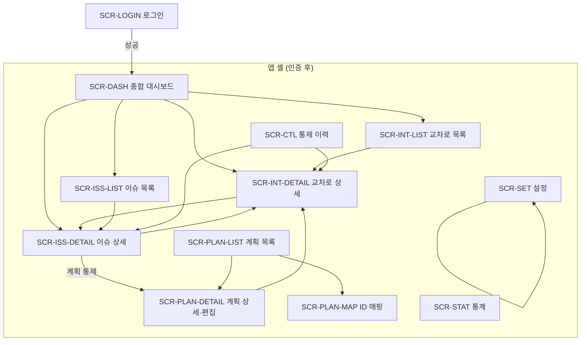

# Signal Guard 화면 IA · 와이어

| 항목 | 내용 |
|------|------|
| 문서명 | 실시간 교통신호 상태정보 오류검지 시스템 화면 정보구조(IA) 설계서 |
| 프로젝트 | Signal Guard |
| 버전 | 0.1 |
| 작성일 | 2026-09-19 |
| 작성 | 조찬희 (기획·PM·프론트엔드), 기경현 (백엔드·데이터, 권한·데이터 정합 교차) |
| 단계 | 설계 1주차 (전체 4주, WBS-3.3) |
| 근거 | 요구사항정의서 12장, 유스케이스사용자스토리 7.3, 시스템아키텍처 5장, SFR-005, SIR-001 |

---

## 개정 이력

| 버전 | 일자 | 작성 | 변경 내용 |
|------|------|------|-----------|
| 0.1 | 2026-09-19 | 조찬희, 기경현 | 최초 작성. 사이트맵·앱 셸·필수 6화면 와이어·권한 매트릭스 확정. 미결 7(현장 통제 요청 UI 위치) 결정 |

---

## 1. 개요

### 1.1 목적

본 문서는 Signal Guard **화면을 무엇으로 나누고, 어떤 순서로 이동하며, 한 화면에 무엇을 둘지**를 고정한다. 프로토타입(WBS-3.7)·프론트 셸(EN-FE-01)·API 명세는 본 문서의 화면 ID(`SCR-*`)를 헤더에 적는다.

한 줄로 말하면, 운영자는 **한 화면에서 이상을 보고** 교차로·이슈로 들어가고, 관리자는 **이슈 상세에서 세 갈래 통제**를 닫는다. 현장 신호기를 조작하는 화면은 없다.

### 1.2 문서 관계

```
요구사항정의서 12장 (화면 목록)     유스케이스 (누가·어떻게)
        │                              │
        └──────────────┬───────────────┘
                       ▼
              시스템아키텍처 1계층     ← 화면 이름·권한 초안
                       │
                       ▼
              본 문서 (IA·와이어)     ← 화면 ID·레이아웃 정본
                       │
        ┌──────────────┼──────────────┐
        ▼              ▼              ▼
   프로토타입      REST API 명세     EN-FE-01 셸
```

| 구분 | 정본 | 본 문서에서 하는 일 |
|------|------|---------------------|
| 기능·수용 기준 | `분석/요구사항정의서.md` | FR/NFR을 화면·영역에 매핑 |
| 유스케이스 | `분석/유스케이스사용자스토리.md` | UC를 화면 흐름에 매핑 |
| 계층·컴포넌트 | `설계/시스템아키텍처.md` | C-MON, C-ISS, C-PUB 등과 화면을 연결 |
| 데이터 | `설계/ERD.md` | 조회 엔터티를 영역 옆에 적음 |
| 픽셀·컴포넌트 라이브러리 | 프로토타입 / 구현 | 본 문서는 구역(zone)과 우선순위만 |

### 1.3 작성 범위 (WBS-3.3)

**포함**

- 사이트맵과 화면 인벤토리 (`SCR-*`)
- 전역 앱 셸, 역할별 메뉴
- 필수 6화면의 구역 와이어 (저충실도)
- 보조 화면(로그인, 목록, 상세, 통제 이력, 설정 탭)
- 화면 간 흐름(관제·통제 루프)
- 공통 UX 패턴, 빈/오류/권한 상태
- 미결 7 결정 (현장 통제 요청 UI 위치)

**포함하지 않음**

- 클릭 가능한 프로토타입 (WBS-3.7, 핵심 3화면)
- REST 경로 문자열 → `설계/API명세.md`. 본 문서의 URL은 **프론트 라우트**다
- 색상 토큰·타이포 스케일 확정 (구현 EN-FE-01)
- 지도 관제 레이아웃 (FR-MON-006, 1차 제외)
- 모바일 전용 앱. 데스크톱 밀도 우선, 기본 반응형만

### 1.4 용어

요구사항정의서 3장과 같다. 화면에서만 쓰는 말을 아래에 둔다.

| 화면 용어 | 의미 |
|-----------|------|
| 앱 셸 | 로그인 후 공통 헤더·사이드바·본문 프레임 |
| 구역 (zone) | 한 화면 안의 레이아웃 덩어리. 와이어의 상자 |
| 제공 값 | 대시보드 기본 표시. `signal_status_current` |
| 원본 값 | 수신 당시 값. `signal_status_raw`. 불변 |
| 추정 | UI 타이머로 1초 감소 중인 표시. 원본을 바꾸지 않음 |
| 제공 중지 | 해당 교차로·방향 정보가 서비스 값으로 나가지 않음 |
| 필수 6화면 | NFR-USA-001 브라우저 점검 대상. 2.2절 |

---

## 2. IA 목표와 원칙

### 2.1 목표

| ID | 목표 | 근거 |
|----|------|------|
| IA-01 | 로그인 직후 추가 이동 없이 운영 규모를 본다 | FR-MON-001, US-MON-01 |
| IA-02 | 이상 교차로 → 상세 → 이슈 → 통제가 3클릭 이내 | 아키텍처 13.6 관제 루프 |
| IA-03 | 운영자는 조회·코멘트만, 통제 버튼은 관리자만 | FR-ADM-001, NFR-SEC-001 |
| IA-04 | 원본과 제공 값이 한 화면에서 나란히 보인다 | FR-CTL-001, UC11 |
| IA-05 | 정보 / 계획 / 현장 요청이 이슈 맥락에서 선택된다 | FR-CTL-002~004, 미결 7 |
| IA-06 | 현장 신호기 조작 UI가 없다 | CON-003 |
| IA-07 | 표본 규모에서 주요 화면 3초 | NFR-PER-001 |
| IA-08 | 과한 장식 없이 정보 구조 우선 | NFR-USA-001, SIR-001 |

### 2.2 필수 6화면 (NFR-USA-001)

프로젝트정의서 8.2·요구사항 12장과 맞춘다. **로그인 화면은 게이트**이며 6에 넣지 않는다.

| 순 | 화면 ID | 명칭 | 주 요구 | 역할 |
|----|---------|------|---------|------|
| 1 | SCR-DASH | 종합 대시보드 | FR-MON-001 | 운영자, 관리자 |
| 2 | SCR-INT-DETAIL | 교차로 상세 | FR-MON-002 | 운영자, 관리자 |
| 3 | SCR-ISS | 오류·이슈 (목록+상세) | FR-MON-003, FR-ISS-*, FR-CTL-002~004 | 운영자 조회·코멘트, 관리자 통제 |
| 4 | SCR-PLAN | 신호 계획 | FR-MON-005, FR-CTL-003 | 운영자 조회, 관리자 수정 |
| 5 | SCR-STAT | 통계·리포트 | FR-MON-004 | 운영자, 관리자 |
| 6 | SCR-SET | 설정 | FR-ADM-002, FR-ADM-001 | 관리자 |

목록과 상세를 같은 메뉴 아래로 묶으면 Chrome/Edge 점검 단위는 위 6개다. 교차로 목록(SCR-INT-LIST)·통제 이력(SCR-CTL)은 **보조 화면**이다.

### 2.3 설계 원칙

| 원칙 | 적용 |
|------|------|
| 데스크톱 밀도 | 1280px 이상에서 지표·테이블이 한 화면에 들어온다. 768px 이하는 사이드바를 접고 세로 스택 |
| 제공 값이 기본 | 숫자·점등의 1차 표시는 제공 계층. 원본은 “원본” 라벨이 붙은 병기 영역 |
| 숨김 ≠ 인가 | 운영자에게 통제 버튼을 그리지 않는다. 그래도 API는 403이어야 한다 |
| 폴링 1차 | 대시보드·이슈 목록·교차로 상세는 설정 주기로 GET. 웹소켓은 자리만 남긴다 |
| 지도 1차 제외 | 대시보드에 지도 구역을 예약하지 않는다. 테이블·카드로 관제한다 |
| 작업은 이슈에서 | 값을 바꾸는 행위는 이슈 상세의 통제 패널. 교차로 상세는 이해, 계획 화면은 계획 편집 |
| 빈 상태 명시 | 집계 없음, 수집 실패, 미매핑, 제공 중지를 “데이터 없음” 한 줄로 뭉개지 않는다 |

### 2.4 이번에 닫는 미결 (요구사항 13장 7번)

| 질문 | 결정 |
|------|------|
| 현장 통제 요청 UI를 이슈 상세에 둘 것인가, 별도 화면인가 | **이슈 상세(SCR-ISS-DETAIL)의 통제 패널**에 둔다 |

근거:

1. UC07의 주 무대는 이슈다. 정보·계획·현장 요청을 같은 패널에서 고른다.
2. R06은 정보 통제만으로 종료할 수 없다. 이슈 화면에 현장 요청이 있어야 가드가 보인다.
3. 통제 이력(SCR-CTL)은 **조회 전용**이다. 요청을 여기서 새로 만들지 않는다. 행을 누르면 이슈 상세로 돌아간다.

아키텍처 C-ISS / C-AUD, ERD `field_control_request`는 그대로다. 바뀌는 것은 1계층 진입점뿐이다.

---

## 3. 사용자 · 권한 · 메뉴

### 3.1 역할

| 역할 | 화면 목표 | 못하는 것 |
|------|-----------|-----------|
| 운영자 | 지금 이상·미처리 이슈·통계를 보고 코멘트한다 | 제공 값 수정, 제공 차단, 계획 수정, 현장 요청, 이슈 종료, 계정·임계값·수집 대상 |
| 관리자 | 운영자 목표 + 오류를 세 갈래로 닫고 기준을 유지한다 | 원본 수신 수정, 신호기 실제어 (시스템에도 없음) |

비로그인 사용자는 SCR-LOGIN만 본다. 그 외 라우트는 로그인으로 보낸다.

### 3.2 전역 메뉴 (L1)

왼쪽 사이드바. 현재 위치가 강조된다. 배지는 미처리 이슈 수(OPEN+ACK+IN_PROGRESS).

| 순서 | 메뉴 | 라우트 | 운영자 | 관리자 | 랜딩 |
|------|------|--------|--------|--------|------|
| 1 | 대시보드 | `/dashboard` | ○ | ○ | 로그인 직후 |
| 2 | 교차로 | `/intersections` | ○ | ○ | 목록 |
| 3 | 이슈 | `/issues` | ○ | ○ | 목록. 배지 |
| 4 | 신호계획 | `/plans` | ○ | ○ | 목록 |
| 5 | 통계 | `/stats` | ○ | ○ | 주 집계 |
| 6 | 통제이력 | `/controls` | ○ 조회 | ○ 조회 | 목록 |
| 7 | 설정 | `/settings` | × (메뉴 숨김) | ○ | 수집 탭 |

운영자가 `/settings`를 직접 입력하면 403 동등 안내 + 대시보드로 보낸다.

### 3.3 권한 매트릭스 (화면 × 행위)

| 행위 | 운영자 | 관리자 | 화면 |
|------|--------|--------|------|
| 로그인·로그아웃 | ○ | ○ | SCR-LOGIN |
| 대시보드·목록·상세 조회 | ○ | ○ | 전 조회 화면 |
| 이슈 코멘트 | ○ | ○ | SCR-ISS-DETAIL |
| 이슈 ACK 수준 확인 | ○ (확인 코멘트) | ○ (상태 전이) | SCR-ISS-DETAIL |
| 이슈 상태 전이·종료·오탐 | × | ○ | SCR-ISS-DETAIL |
| 제공 값 대체·제공 차단 | × | ○ | SCR-ISS-DETAIL |
| 계획 수정·재검증 | × | ○ | SCR-PLAN-DETAIL (이슈에서 진입) |
| 현장 통제 요청 등록 | × | ○ | SCR-ISS-DETAIL |
| ID 매핑 확정·해제 | × | ○ | SCR-PLAN-MAP |
| 감시 제외 | × | ○ | SCR-SET-WATCH |
| 수집 대상·주기·임계값 | × | ○ | SCR-SET-* |
| 계정 CRUD | × | ○ | SCR-SET-ACC |
| 통계 CSV | ○ | ○ | SCR-STAT |
| 통제 이력 조회 | ○ | ○ | SCR-CTL |
| 원본/제공 병기 조회 | ○ | ○ | SCR-INT-DETAIL, SCR-CTL |

---

## 4. 사이트맵



설정 내부 탭은 사이트맵에서 한 노드다. 4.1에서 펼친다.

### 4.1 화면 인벤토리

| ID | 명칭 | 깊이 | MVP | 주 액터 | 관련 UC | 관련 컴포넌트 | 주 엔터티 |
|----|------|------|-----|---------|---------|---------------|-----------|
| SCR-LOGIN | 로그인 | 0 | 필수 | 전체 | UC09 | C-AUTH | `app_user` |
| SCR-DASH | 종합 대시보드 | 1 | **필수 6** | 운영자, 관리자 | UC06 | C-MON, C-COL | `signal_status_current`, `quota_daily`, `stat_bucket` |
| SCR-INT-LIST | 교차로 목록 | 1 | 보조 | 운영자, 관리자 | UC06 | C-SIG, C-MON | `intersection`, `collection_target` |
| SCR-INT-DETAIL | 교차로 상세 | 2 | **필수 6** | 운영자, 관리자 | UC06, UC11 | C-SIG, C-PUB | `signal_status_current`, `signal_status_raw` |
| SCR-ISS-LIST | 이슈 목록 | 1 | **필수 6** (이슈) | 운영자, 관리자 | UC05, UC06 | C-ISS | `issue` |
| SCR-ISS-DETAIL | 이슈 상세·통제 | 2 | **필수 6** (이슈) | 운영자 / 관리자 | UC07, UC11 | C-ISS, C-PUB | `issue`, `control_log`, `field_control_request` |
| SCR-PLAN-LIST | 신호 계획 목록 | 1 | **필수 6** (계획) | 운영자, 관리자 | UC02 | C-PLN | `signal_plan`, `intersection_id_map` |
| SCR-PLAN-DETAIL | 계획 상세·편집 | 2 | **필수 6** (계획) | 조회=전체, 수정=관리자 | UC02, UC07 | C-PLN | `signal_plan`, `signal_plan_phase` |
| SCR-PLAN-MAP | ID 매핑 | 2 | 필수 기능, 계획 하위 | 관리자 | UC02 | C-PLN | `intersection_id_map` |
| SCR-STAT | 통계·리포트 | 1 | **필수 6** | 운영자, 관리자 | UC08 | C-RPT | `stat_bucket` |
| SCR-CTL | 통제 이력 | 1 | 보조 | 운영자, 관리자 | UC11 | C-AUD | `control_log` |
| SCR-SET | 설정 (셸) | 1 | **필수 6** | 관리자 | UC10, UC09 | C-RUL, C-COL, C-AUTH | — |
| SCR-SET-COL | 설정 · 수집 | 2 | 설정 탭 | 관리자 | UC10 | C-COL | `collection_target`, `quota_daily`, `app_setting` |
| SCR-SET-RULE | 설정 · 임계값 | 2 | 설정 탭 | 관리자 | UC10 | C-RUL | `rule_threshold` |
| SCR-SET-WATCH | 설정 · 감시 제외 | 2 | 중요(US-CTL-04) | 관리자 | UC07 | C-ISS | `intersection_watch_exclusion` |
| SCR-SET-ACC | 설정 · 계정 | 2 | 설정 탭 | 관리자 | UC09 | C-AUTH | `app_user` |

SCR-SET-WATCH는 중요 스토리다. 일정 허용 시 설정 네 번째 탭으로 넣는다. 1차에서 빼도 설정 화면 자체는 성립한다.

### 4.2 프론트 라우트

API 경로가 아니다. EN-FE-01 라우터의 출발점이다.

| 라우트 | 화면 | 비고 |
|--------|------|------|
| `/login` | SCR-LOGIN | 인증 시 `/dashboard` |
| `/dashboard` | SCR-DASH | 기본 홈 |
| `/intersections` | SCR-INT-LIST | 쿼리: `severity`, `q`, `blocked` |
| `/intersections/:id` | SCR-INT-DETAIL | |
| `/issues` | SCR-ISS-LIST | 쿼리: `status`, `severity`, `rule`, `from`, `to`, `intersection` |
| `/issues/:id` | SCR-ISS-DETAIL | |
| `/plans` | SCR-PLAN-LIST | 쿼리: `source`, `mapStatus` |
| `/plans/:id` | SCR-PLAN-DETAIL | 쿼리: `issueId` (이슈에서 진입 시 복귀) |
| `/plans/mapping` | SCR-PLAN-MAP | 관리자 |
| `/stats` | SCR-STAT | 쿼리: `grain`, `from`, `to`, `intersection`, `rule` |
| `/controls` | SCR-CTL | 쿼리: `type`, `intersection` |
| `/settings` | SCR-SET-COL | `/settings/collection`과 동일 |
| `/settings/rules` | SCR-SET-RULE | |
| `/settings/watch` | SCR-SET-WATCH | |
| `/settings/accounts` | SCR-SET-ACC | |

알 수 없는 경로는 대시보드. 권한 없는 경로는 안내 후 대시보드.

---

## 5. 앱 셸

모든 인증 화면이 공유한다. EN-FE-01의 산출이다.

```
┌─────────────────────────────────────────────────────────────┐
│ [Signal Guard]   마지막 수신 12:04:11  추정표시  쿼터 2,880/5,000 │
│                  이슈 배지 3          관리자 조찬희  [로그아웃] │
├──────────┬──────────────────────────────────────────────────┤
│ 대시보드  │                                                  │
│ 교차로    │                  본문 (화면별)                    │
│ 이슈  (3) │                                                  │
│ 신호계획  │                                                  │
│ 통계     │                                                  │
│ 통제이력  │                                                  │
│ 설정 *   │                                                  │
└──────────┴──────────────────────────────────────────────────┘
 * 설정은 관리자만
```

### 5.1 헤더 구역

| 요소 | 내용 | 근거 |
|------|------|------|
| 제품명 | Signal Guard. 클릭 시 대시보드 | — |
| 마지막 수신 | 표본 전체 중 최신 `last_received_at` | NFR-USA-002 |
| 폴링 상태 | `갱신 n초 전` / `갱신 중` / `수집 장애` | FR-MON-003-1 대체 |
| 쿼터 | 당일 사용/한도. 80% 이상 경고색, 한도 도달 시 배너 | FR-COL-005 |
| 이슈 배지 | 미종료 수. 클릭 시 `/issues?status=OPEN` | FR-MON-003 |
| 사용자 | 표시 이름 + 역할 | FR-ADM-001 |
| 로그아웃 | 세션 종료 후 로그인 | UC09 |

CRITICAL 신규가 폴링으로 들어오면 헤더 배지가 즉시 바뀐다. 토스트는 선택. 1차는 배지+목록 상단으로 충분하다.

### 5.2 사이드바

- 너비 고정, 아이콘+라벨. 접으면 아이콘만 (1024px 미만).
- 설정 하위는 사이드바에 펼치지 않고, 설정 본문의 탭으로 둔다.
- 운영자 빌드에서 설정 항목을 DOM에 넣지 않는 것을 권장한다 (숨김만으로 끝내지 말라는 서버 원칙과 별개).

### 5.3 본문 공통

| 패턴 | 규칙 |
|------|------|
| 페이지 제목 | H1 하나. 보조 설명은 한 줄 |
| 필터 | 제목 아래 가로 한 줄. 적용은 즉시(디바운스) 또는 [적용] |
| 1차 콘텐츠 | 차트·테이블·8방향 그리드 |
| 2차 콘텐츠 | 타임라인, 이력, 도움말 |
| 진행 | 3초를 넘길 수 있는 조회는 스켈레톤 또는 진행 표시 |
| 브레드크럼 | `이슈 / ISS-142` 처럼 깊이 2만. 대시보드는 없음 |

### 5.4 갱신 정책

| 화면 | 폴링 | 비고 |
|------|------|------|
| SCR-DASH | 기본 30초 (설정 가능) | 지표·미처리 |
| SCR-ISS-LIST | 동일 | 신규 상단·배지 |
| SCR-INT-DETAIL | 1초 타이머(표시) + 상태 GET은 수집 주기와 맞춤 | 추정 플래그 |
| 그 외 | 진입 시 1회. 수동 새로고침 | 통계는 집계 테이블 |

웹소켓을 넣어도 셸·사이트맵은 바꾸지 않는다.

---

## 6. 화면 간 핵심 흐름

### 6.1 관제 루프 (운영자 · 관리자)

아키텍처 13.6을 라우트로 푼다.

```
SCR-DASH
  → KPI 오류 교차로 수 클릭 → SCR-INT-LIST?severity=ERROR
  → 행 클릭 → SCR-INT-DETAIL
       → 원본 vs 제공 확인
       → 관련 이슈 클릭 → SCR-ISS-DETAIL
  또는
  → 미처리 이슈 클릭 → SCR-ISS-LIST
  → 행 클릭 → SCR-ISS-DETAIL
```

운영자는 여기까지다. 코멘트만 남긴다.

### 6.2 통제 루프 (관리자)

```
SCR-ISS-DETAIL 통제 패널
  ├─ 정보 통제 → 제공 대체 또는 제공 차단 → 재검증 결과 표시 → 상태 RESOLVED
  ├─ 계획 통제 → SCR-PLAN-DETAIL?issueId= → 저장·재검증 → 이슈로 복귀
  └─ 현장 통제 요청 → 같은 패널에서 요청 본문 저장
                      → 제공 차단 기본 체크
                      → 신호기 전송 UI 없음
                      → 요청 상태 OPEN
```

R06(CRITICAL 충돌 녹색): 정보 통제 라디오만으로는 [해결]이 비활성. 현장 요청이 있어야 종료 가능.

### 6.3 대표 시나리오 × 화면

| 시나리오 (유스케이스 5장) | 화면 경로 |
|---------------------------|-----------|
| 5.1 정상·자동보정 | SCR-DASH (자동보정 N건) → SCR-INT-DETAIL (원본≠제공) → SCR-CTL (`AUTO_INFO`) |
| 5.2 계획 불일치 | SCR-ISS-DETAIL → SCR-PLAN-DETAIL → 복귀 → RESOLVED |
| 5.3 충돌 녹색 | SCR-DASH (CRITICAL) → SCR-ISS-DETAIL → 현장 요청 + 제공 중지 배너 |
| 5.4 쿼터·장애 | SCR-DASH 쿼터 경고 / 마지막 수신·실패 이유. 화면 유지 |

---

## 7. 공통 UX 패턴

와이어보다 먼저 고정한다. 모든 필수 화면이 이를 쓴다.

### 7.1 등급

| 코드 | 화면 라벨 | 표시 |
|------|-----------|------|
| INFO | 정보 | 중립 배지. 자동보정 완료 |
| WARN | 경고 | 노란 배지 |
| ERROR | 오류 | 주황 배지, 목록 상단 후보 |
| CRITICAL | 치명 | 빨강 배지, 최상단 |

색만으로 구분하지 않는다. 라벨 텍스트를 같이 둔다.

### 7.2 상태 배지

| 배지 | 언제 |
|------|------|
| 제공 중지 | `is_blocked` |
| 추정 | `is_estimated`. 마지막 수신 시각을 옆에 둠 |
| 감시 제외 | 제외 기간 중 |
| 미매핑 | 계획 대조 생략 중 |
| 쿼터 중단 | 당일 수집 정지 |

### 7.3 원본 vs 제공

두 열 테이블. 값이 다르면 제공 쪽을 강조한다.

| 항목 | 원본 | 제공 |
|------|------|------|
| 잔여시간 | 18000 cs (180.00초) | 180초 |
| 점등 | `stop-And-Remain` | 정지 |
| 수신 시각 | 시스템 수신 | (동일 배치) |

원본 열은 읽기 전용임을 캡션으로 적는다.

### 7.4 빈 · 오류 · 권한

| 상태 | 카피 요지 |
|------|-----------|
| 아직 수집 전 | 시드가 없으면 “수집 이력이 없습니다. 관리자에게 표본 설정을 요청하세요.” |
| 집계 없음 | “집계 없음 / 배치 대기”. 빈 차트만 그리지 않는다 |
| 수집 장애 | 마지막 수신 시각 + 실패 코드. 화면은 유지 |
| 403 | “이 작업은 관리자만 할 수 있습니다.” |
| 허용되지 않는 이슈 전이 | 필드 옆 오류. 페이지 전체 크래시 금지 |
| 운영자 통제 시도 | 버튼 없음. 직접 API면 서버 거부 |

### 7.5 잔여시간 타이머

교차로 상세(및 대시보드 카드의 대표 잔여시간)에서 수집 공백 동안 1초 감소.

- 캡션: `추정 표시 · 마지막 수신 12:04:11`
- 계획·직전과 모순이면 타이머를 멈추고 추정 배지를 끈다 (엔진 판단).
- 저장 원본은 변하지 않는다.

### 7.6 확인 모달

파괴적·통제 행위에만 둔다.

- 제공 차단 / 차단 해제
- 계획 저장 (재검증이 돈다는 문구)
- 현장 통제 요청 (“신호제어기에 명령을 보내지 않습니다”)
- 계정 삭제
- 이슈 CLOSED / FALSE_POSITIVE

---

## 8. 화면 상세 · 와이어

저충실도. 픽셀이 아니라 **구역 우선순위**(P1이 가장 중요)다.

---

### 8.1 SCR-LOGIN 로그인

| 항목 | 내용 |
|------|------|
| 목적 | 역할 세션을 연다 |
| 진입 | 비로그인, 세션 만료 |
| 이탈 | `/dashboard` |
| P1 | 로그인 ID, 비밀번호, [로그인] |
| 두지 않음 | 회원가입, 소셜 로그인, 비밀번호 찾기(수업 시드는 관리자 재설정) |

```
┌─────────────────────┐
│     Signal Guard    │
│  실시간 교통신호     │
│  상태정보 오류검지   │
│                     │
│  아이디  [        ] │
│  비밀번호 [        ] │
│  [ 로그인 ]         │
│  실패 시 일반 오류   │
└─────────────────────┘
```

계정 열거를 줄이기 위해 “아이디가 없습니다 / 비밀번호가 틀렸습니다”를 나누지 않는다.

---

### 8.2 SCR-DASH 종합 대시보드 (필수 1)

| 항목 | 내용 |
|------|------|
| 목적 | 30초 안에 어디를 볼지 정한다 |
| 진입 | 로그인 홈, 로고 |
| 이탈 | 교차로 목록/상세, 이슈 목록/상세, 통계(추이 클릭) |
| 조회 엔터티 | current 집계, quota, 최근 issue, 시간 버킷 |

**구역**

| 우선 | 구역 | 내용 | 클릭 |
|------|------|------|------|
| P1 | KPI 스트립 | 전체 / 정상 / 경고 / 오류 교차로 수, 미처리 이슈, 자동보정 N건, 수신 지연(초), 쿼터 사용/한도 | 각 카드 → 필터된 목록 |
| P2 | 시간대 오류 추이 | 오늘(또는 최근 24h) 등급별 막대/선 | SCR-STAT 해당 구간 |
| P3 | 이상 교차로 | 등급 높은 순 테이블: 명칭, 등급, 대표 규칙, 제공 중지, 수신 | SCR-INT-DETAIL |
| P3 | 최근 이슈 | 미종료 5~10건 | SCR-ISS-DETAIL |
| P4 | 수집 상태 | 마지막 배치 시각, 성공/실패, QUOTA_STOP 여부 | SCR-SET-COL (관리자) |

지도 구역을 그리지 않는다.

```
┌ KPI: 전체 30  정상 24  경고 4  오류 2  │ 미처리 3  자동보정 12  지연 8s  쿼터 2880/5000 ┐
├──────────────────────────────┬─────────────────────────────────────────────────────┤
│ 시간대 오류 추이 (차트)        │ 최근 이슈                                          │
│                              │ ISS-142 R06 CRITICAL 부평역 교차로  OPEN             │
├──────────────────────────────┴─────────────────────────────────────────────────────┤
│ 이상 교차로                                                                      │
│ 부평역앞  CRITICAL  R06  제공중지  12:04  │ 계산교차로  ERROR  R03  12:03            │
└ 수집: 마지막 배치 12:04 성공 29 / 실패 1 ──────────────────────────────────────────┘
```

**수용 (화면)**

- 로그인 후 이 레이아웃이 바로 보인다.
- 오류 수와 미처리 이슈가 추가 메뉴 이동 없이 있다.
- 운영자에게 통제 버튼이 없다.

---

### 8.3 SCR-INT-LIST 교차로 목록 (보조)

| 항목 | 내용 |
|------|------|
| 목적 | 표본 전체를 검색·필터한다. 대시보드는 이상만 보여 주므로 목록이 필요하다 |
| 필터 | 이름/ID 검색, 등급, 제공 중지, 매핑 여부, 수집 대상 여부 |
| 열 | 명칭, crsrdId, 최고 등급, 미종료 이슈, 제공 중지, 매핑, 마지막 수신 |
| 행 클릭 | SCR-INT-DETAIL |

관리자만 행 옆 [수집 제외] 단축을 둘 수 있으나, 본 편집은 설정 탭이 정본이다.

---

### 8.4 SCR-INT-DETAIL 교차로 상세 (필수 2)

| 항목 | 내용 |
|------|------|
| 목적 | 이슈를 열기 전에 8방향과 원본/제공을 이해한다 |
| 진입 | 목록, 대시보드, 이슈의 교차로 링크 |
| 이탈 | 관련 이슈 상세, 계획 상세(조회), 통제 이력(해당 교차로 필터) |

**구역**

| 우선 | 구역 | 내용 |
|------|------|------|
| P1 | 헤더 | 명칭, ID, 지자체, 최고 등급, 제공 중지, 추정, 매핑 상태, 감시 제외, 마지막 수신 |
| P1 | 8방향 그리드 | nt/et/st/wt + 대각. 방향마다 직진·좌회전·보행 등 점등·잔여시간(제공). 차단된 슬롯은 “제공 중지” |
| P2 | 계획 대비 | 현재 시각 유효 계획의 기대 점등·유지시간 vs 실측. 미매핑이면 “계획 대조 생략” |
| P2 | 원본 vs 제공 | 7.3 테이블. 방향 선택에 따라 갱신 |
| P3 | 검증 타임라인 | 최근 `validation_result` (규칙, 등급, 시각) |
| P3 | 관련 이슈 | 미종료 이슈 목록 |
| P4 | 제공 이력 요약 | 최근 통제 3건. 더 보기 → SCR-CTL |

운영자·관리자 모두 **이 화면에서 값을 고치지 않는다.** 관리자의 정보 통제는 이슈 상세로 보낸다. 이슈가 없으면 “이 교차로에 열린 이슈가 없습니다. 검지 로그를 확인하세요.”

```
┌ 부평역앞  [CRITICAL] [제공 중지] [추정]  마지막 수신 12:04:11  매핑 확정 ┐
├─────────────┬─────────────┬─────────────┬─────────────┤
│ 북 nt       │ 동 et       │ 남 st       │ 서 wt       │
│ 직진 녹 28s │ 직진 적  5s │ 직진 녹 28s │ 직진 적  5s │
│ 보행 적     │ 보행 녹 12s │ 보행 적     │ 보행 녹 12s │
├─────────────┴─────────────┴─────────────┴─────────────┤
│ 계획 대비: 직진 녹 유지 30s 예정 · 실측 28s (추정)                    │
│ 원본 잔여  2800cs │ 제공 28s  ← 다름 강조                             │
│ 검증: 12:04 R06 CRITICAL · 12:03 R11 ERROR                           │
│ 이슈: ISS-142 충돌 녹색 OPEN  [열기]                                  │
└─────────────────────────────────────────────────────────────────────┘
```

대각 4칸은 접힌 “대각 방향” 토글로 두어 1280px에서 P1이 밀리지 않게 한다.

---

### 8.5 SCR-ISS-LIST · SCR-ISS-DETAIL 오류·이슈 (필수 3)

이슈는 **목록과 상세를 한 메뉴**로 둔다. 와이드 화면에서 마스터-디테일을 써도 되고, 좁으면 목록→상세 스택이어도 된다. 화면 ID는 둘로 나눈다.

#### 목록

| 필터 | 유형(규칙), 등급, 기간, 교차로, 상태 |
|------|--------------------------------------|
| 정렬 | 기본: 등급(CRITICAL 우선) + 최근 갱신 |
| 열 | ID, 교차로, 방향, 규칙, 등급, 상태, 발생, 담당 |
| 신규 | ERROR/CRITICAL이면 상단 고정 또는 배지 증가. 폴링 |

운영자는 행에서 상세만 연다.

#### 상세 — 조회 영역 (전원)

| 우선 | 구역 |
|------|------|
| P1 | 헤더: 이슈 ID, 등급, 상태, 교차로·방향, 규칙 ID·이름 |
| P1 | 스냅샷: 발생 시점 원본/제공 (이슈 JSON, 불변) |
| P2 | 추정 원인, 최근 관측(갱신된 값) |
| P2 | 교차로 바로가기, 해당 계획 바로가기 |
| P3 | 상태 이력 타임라인, 코멘트 입력 (운영자 가능) |

#### 상세 — 통제 패널 (관리자만) ★ 미결 7 정본

패널 제목: **오류 통제**. 설명 한 줄: “원본 수신은 바뀌지 않습니다.”

세그먼트(라디오):

| 선택 | 동작 | 결과 이력 |
|------|------|-----------|
| 정보 통제 | (a) 제공 값 대체 폼 (잔여초, 점등) (b) 제공 차단 체크 (c) 추정 표시 유지 | `MANUAL_INFO` / `PUBLISH_BLOCK` |
| 계획 통제 | [계획 수정 화면으로] → `?issueId=` | 저장 시 `PLAN_UPDATE`, 이슈로 복귀 |
| 현장 통제 요청 | 요청 내용 텍스트, 방향, 규칙 자동 채움. 문구: **신호제어기에 명령을 전송하지 않습니다.** 저장 시 제공 차단 기본 ON | `FIELD_REQUEST`, `field_control_request` |

하단 공통: 상태 전이 (ACK / IN_PROGRESS / RESOLVED / CLOSED / FALSE_POSITIVE), 담당 지정, [재검증].

```
┌ ISS-142  R06 충돌 녹색  [CRITICAL]  OPEN  부평역앞 / 북 직진 vs 보행 ┐
│ 원본 스냅샷 (읽기전용)     제공 스냅샷                                │
│ 이력: 12:04 시스템 OPEN                                             │
│ 코멘트: [운영자도 입력] [등록]                                      │
├ 통제 패널 (관리자) ─────────────────────────────────────────────────┤
│ ○ 정보 통제   ○ 계획 통제   ● 현장 통제 요청                         │
│ 요청 내용 [충돌 현시 해제 확인 요청                              ]   │
│ ☑ 해당 교차로 정보 제공 차단 (기본)                                 │
│ 안내: 신호제어기에 점등·주기 명령을 보내지 않습니다.                 │
│ [요청 등록]  상태 [ACK ▾]  [재검증]                                 │
└─────────────────────────────────────────────────────────────────────┘
```

**가드**

- 운영자: 통제 패널 전체 미렌더. 코멘트·조회만.
- R06을 정보 통제만으로 RESOLVED 시도 → 거부 메시지.
- 현장 요청 성공 후에도 외부 신호기 호출 0건 (화면에 전송 버튼 없음).

---

### 8.6 SCR-PLAN 신호 계획 (필수 4)

목록 · 상세 · 매핑을 한 메뉴 아래 둔다.

#### 목록 SCR-PLAN-LIST

| 열 | 교차로, 출처(UTIC/수동/추정/시드), 매핑 상태, 활성 계획 여부, 사이클(초), 수정 시각 |
| 필터 | 출처, 매핑(미매핑/후보/확정) |
| 관리자 | [매핑 작업] → SCR-PLAN-MAP, 행 → 상세 |

출처는 배지로 보여, UTIC 미승인이 결함처럼 보이지 않게 한다.

#### 상세 SCR-PLAN-DETAIL

| 우선 | 구역 |
|------|------|
| P1 | 헤더: 교차로, 출처, TOD 유효 구간, 요일, 사이클, 옵셋 |
| P1 | 현시 테이블: 순서, 방향, 종류, 유지시간, 링 |
| P2 | 동시 점등 제약 목록 (R06 기준) |
| P2 | 관리자: 인라인 편집 후 [저장하고 재검증] |
| P3 | 이슈에서 왔으면 상단 배너 “ISS-142 계획 통제 중” + [이슈로 돌아가기] |

운영자는 입력 컨트롤이 비활성(또는 폼이 아님).

#### 매핑 SCR-PLAN-MAP (관리자)

이름·좌표 후보 테이블. [확정] / [해제]. 미매핑은 계획 대조를 하지 않는다는 안내.

---

### 8.7 SCR-STAT 통계·리포트 (필수 5)

| 우선 | 구역 |
|------|------|
| P1 | 필터: 알갱이(시간/일/주/월), 기간, 교차로, 규칙 |
| P1 | KPI: 오류율, 자동보정 vs 수동조치 비율, CRITICAL 건수 |
| P2 | 차트: 기간 추이, 다발 교차로, 규칙별 발생 |
| P3 | 상세 테이블 + [CSV 다운로드] |

CSV는 **지금 필터**를 그대로 담는다. 인쇄는 브라우저 인쇄로 충분 (별도 PDF 엔진 없음).

집계 전이면 7.4 빈 상태. 원본 풀스캔 스피너를 돌리지 않는다.

---

### 8.8 SCR-CTL 통제 이력 (보조, UC11)

| 목적 | 누가 제공/계획을 왜 바꿨는지 재현한다 |
| 필터 | 유형(AUTO_INFO / MANUAL_INFO / PLAN_UPDATE / PUBLISH_BLOCK / FIELD_REQUEST), 교차로, 기간 |
| 열 | 시각, 유형, 액터, 교차로, 규칙, 이슈, 전→후 요약 |
| 행 | 이슈 또는 교차로 상세. **여기서 INSERT하지 않는다** |

원본 값은 행 확장 또는 상세 서랍에서 제공 전후와 함께 보여 준다.

---

### 8.9 SCR-SET 설정 (필수 6, 관리자)

한 화면, 탭 4개. 기본 탭은 수집.

```
[ 수집 대상·주기 ] [ 규칙 임계값 ] [ 감시 제외 ] [ 계정 ]
```

#### 수집 SCR-SET-COL

- 표본 교차로 추가·제외, 우선순위 (부분 실패는 시스템이 올림)
- 상태 수집 주기(분), 맵 수집 주기
- 쿼터 사용/한도, 한도 근접 시 저장 경고 (일 5,000 전망)
- 폴링 초(화면 갱신). 외부 API 주기와 별개임을 명시

#### 임계값 SCR-SET-RULE

- R01~R12 행: 파라미터 이름, 현재 값, 기본 등급
- 저장 후 “다음 검증부터 반영”
- 변경은 감사 로그

#### 감시 제외 SCR-SET-WATCH (중요)

- 교차로, 시작~종료, 사유
- 기간 중 신규 이슈 없음 안내
- 없으면 탭을 숨겨도 설정 화면은 유효

#### 계정 SCR-SET-ACC

- 목록: 로그인 ID, 이름, 역할, 활성
- 등록·수정·삭제, 비밀번호 재설정 (해시 저장, 평문 미표시)
- 자기 자신 삭제 방지(권장)

운영자는 이 라우트에 들어오지 못한다.

---

## 9. 컴포넌트 → 화면 매핑

아키텍처 2계층을 화면이 어떻게 쓰는지다. HTTP 경로는 `설계/API명세.md` 11장.

| 화면 | 읽는 컴포넌트 | 쓰는 컴포넌트 (관리자) |
|------|----------------|------------------------|
| SCR-DASH | C-MON, C-COL(쿼터), C-ISS(건수) | — |
| SCR-INT-* | C-SIG, C-PUB, C-MON | — |
| SCR-ISS-LIST | C-ISS | — |
| SCR-ISS-DETAIL | C-ISS, C-AUD | C-ISS, C-PUB, C-ISS(현장 요청) |
| SCR-PLAN-* | C-PLN | C-PLN (재검증 C-ENG) |
| SCR-STAT | C-RPT | — (내보내기 GET) |
| SCR-CTL | C-AUD | — |
| SCR-SET-COL | C-COL | C-COL |
| SCR-SET-RULE | C-RUL | C-RUL |
| SCR-SET-ACC | C-AUTH | C-AUTH |
| SCR-LOGIN | C-AUTH | C-AUTH |

브라우저는 외부 실시간 API를 호출하지 않는다.

---

## 10. 반응형 · 접근 · 성능

### 10.1 폭

| 폭 | 동작 |
|----|------|
| ≥1280px | 사이드바 고정, 대시보드 KPI 한 줄, 이슈 마스터-디테일 가능 |
| 768–1279 | 사이드바 아이콘, KPI 2행, 목록/상세 스택 |
| <768 | 기본 반응형. 8방향은 세로 아코디언. **관제 밀도는 데스크톱이 정본** |

수업 시연은 노트북 가로를 전제한다.

### 10.2 사용성 (SIR-001 취지)

- 정보 구조가 색 장식보다 앞선다. 그라데이션·장식 아이콘 남용 금지.
- 등급은 색+텍스트.
- 키보드: 로그인, 필터, 테이블 행 포커스, 주요 버튼.
- 전자정부 인증 마크·전수 접근성 심사는 범위 외.

### 10.3 3초 목표에 대한 IA 쪽 조치

- 대시보드는 current·사전 집계만 요청. 원본 JSON을 홈에 싣지 않는다.
- 교차로 상세의 원본 병기는 선택 방향 1건(또는 last_raw 1건).
- 통계는 `stat_bucket`만.
- 이슈 목록 페이지 크기 기본 20~50.

---

## 11. 요구사항 추적

### 11.1 기능

| 요구 | 화면 |
|------|------|
| FR-MON-001 | SCR-DASH |
| FR-MON-002 | SCR-INT-DETAIL |
| FR-MON-003 | SCR-ISS-LIST, 헤더 배지 |
| FR-MON-003-1 | 셸 폴링. 푸시 미구현은 결함 아님 |
| FR-MON-004 | SCR-STAT |
| FR-MON-005 | SCR-PLAN-* |
| FR-MON-006 | 사이트맵에 노드 없음 (2단계) |
| FR-ISS-001~003 | SCR-ISS-* |
| FR-ISS-004 | SCR-SET-WATCH |
| FR-CTL-001 | SCR-INT-DETAIL, SCR-CTL |
| FR-CTL-002 | SCR-ISS-DETAIL 정보 통제 |
| FR-CTL-003 | SCR-ISS-DETAIL → SCR-PLAN-DETAIL |
| FR-CTL-004 | SCR-ISS-DETAIL 현장 요청 |
| FR-CTL-005 | SCR-CTL |
| FR-COL-005 | SCR-DASH 헤더, SCR-SET-COL |
| FR-ADM-001 | SCR-LOGIN, SCR-SET-ACC, 메뉴 숨김 |
| FR-ADM-002 | SCR-SET-COL, SCR-SET-RULE |
| FR-PLN-003 출처 표시 | SCR-PLAN-LIST 배지 |
| FR-PLN-004 | SCR-PLAN-MAP |

### 11.2 비기능

| 요구 | IA 대응 |
|------|---------|
| NFR-PER-001 | 10.3, 필수 6화면 |
| NFR-USA-001 | 필수 6, 데스크톱 밀도, 기본 반응형 |
| NFR-USA-002 | 헤더 수신 시각, 추정 배지 |
| NFR-SEC-001 | 3.3, 설정 라우트 차단 |
| CON-003 | 전송 버튼 없음, 현장 요청 안내 문구 |

### 11.3 UC → 화면 (유스케이스 7.3 확장)

| UC | 주 화면 |
|----|---------|
| UC01 | SCR-SET-COL (조회), SCR-DASH (지연·쿼터) |
| UC02 | SCR-PLAN-* |
| UC03 | 결과: DASH, INT-DETAIL, ISS-LIST |
| UC04 | SCR-DASH 자동보정 건수, SCR-CTL |
| UC05 | SCR-ISS-LIST, DASH 미처리 |
| UC06 | SCR-DASH, INT-DETAIL, ISS-LIST |
| UC07 | SCR-ISS-DETAIL, PLAN-DETAIL |
| UC08 | SCR-STAT |
| UC09 | SCR-LOGIN, SET-ACC |
| UC10 | SCR-SET-* |
| UC11 | SCR-INT-DETAIL, SCR-CTL |

---

## 12. 설계 결정과 미결

### 12.1 이번에 고정한 것

1. 필수 6화면은 대시보드, 교차로 상세, 이슈, 신호계획, 통계, 설정이다.
2. 전역 네비는 사이드바 7항목(설정은 관리자). 로그인 후 랜딩은 대시보드다.
3. 교차로 목록·통제 이력은 보조 화면으로 사이트맵에 포함한다.
4. 설정은 탭(수집 / 임계값 / 감시 제외 / 계정)이지 톱 레벨 4메뉴가 아니다.
5. **현장 통제 요청은 이슈 상세 통제 패널**에 둔다. 통제 이력은 조회 전용이다.
6. 교차로 상세에서는 값을 수정하지 않는다.
7. 지도·웹소켓 화면 노드는 1차에 없다. 폴링·테이블 관제가 기본이다.
8. 프론트 라우트 표를 EN-FE-01의 출발점으로 쓴다.

### 12.2 아직 고르지 않은 것 (화면 뼈대는 유지)

| No | 내용 | 확정 시점 |
|----|------|-----------|
| 1 | React vs Vue | 5주 게이트. IA 불변 |
| 4 | 웹소켓 | 넣어도 사이트맵 불변 |
| 5 | 지도 | 넣을 경우 SCR-DASH P3를 분할하거나 `/map` 추가. 지금은 없음 |
| W1 | 이슈 목록/상세를 한 화면 스플릿으로 할지 스택으로 할지 | 프로토타입에서 1280px 기준으로 한 가지 |
| W2 | 8방향 그리드의 대각을 기본 펼침으로 할지 | 프로토타입 |
| W3 | 차트 라이브러리 (Chart.js 후보) | EN-FE-01 |

요구사항 미결 1(스택), 2(표본 N·T), 3(UTIC), 6(임계 숫자)는 본 IA의 구역을 바꾸지 않는다.

---

## 13. 다음 산출물

| 순서 | 산출 | WBS | 본 문서와 관계 |
|------|------|-----|----------------|
| 1 | 클릭 프로토타입 (대시보드·이슈 상세·교차로 상세) | 3.7 | 8.2, 8.4, 8.5 |
| 2 | REST API 명세 | 3.5 | `설계/API명세.md` (0.1). 화면 호출은 11장 |
| 3 | EN-FE-01 셸 | 구현 S1 | 5장 앱 셸, 4.2 라우트, 3.2 메뉴 |
| 4 | 본 문서 0.2 | 3.8 | 스택·스플릿 여부·지도 최종 |

프로토타입이 용량에 밀리면 본 문서 와이어를 정적 정본으로 쓰고 3.7을 축소한다 (백로그 WBS 설계 주 주석과 동일).

---

## 14. 검수 체크리스트

- [ ] 필수 6화면이 인벤토리와 와이어에 있다
- [ ] 로그인 후 랜딩이 대시보드다
- [ ] 운영자 메뉴에 설정이 없고 통제 패널이 이슈 상세에서 관리자만이다
- [ ] 원본 vs 제공 병기가 교차로 상세에 있다
- [ ] 정보 / 계획 / 현장 요청이 이슈 상세 한 패널에 있다
- [ ] 현장 요청 화면에 신호기 전송 버튼이 없다
- [ ] 통제 이력은 조회만 한다
- [ ] 지도가 1차 사이트맵에 없다
- [ ] 쿼터·마지막 수신·추정 표시가 셸 또는 상세에 있다
- [ ] FR/UC 추적표가 있다
- [ ] 미결 7이 결정으로 적혀 있다

---

## 15. 참고

- 분석/요구사항정의서.md — 12장 화면 목록, 13장 미결 7, FR-MON/ISS/CTL/ADM
- 분석/유스케이스사용자스토리.md — UC06~UC11, 7.3 화면×UC
- 설계/시스템아키텍처.md — 5장 1계층, 13.6 관제 루프
- 설계/ERD.md — current / raw / issue / control_log / field_control_request
- 백로그WBS.md — WBS-3.3, EN-FE-01, US-MON/ISS/CTL
- 분석/제안요청서요구사항대응표.md — SFR-005 화면(UI)설계서, SIR-001
- 행정안전부 디지털 정부서비스 UI/UX 가이드라인 — 정보 구조 우선 취지
